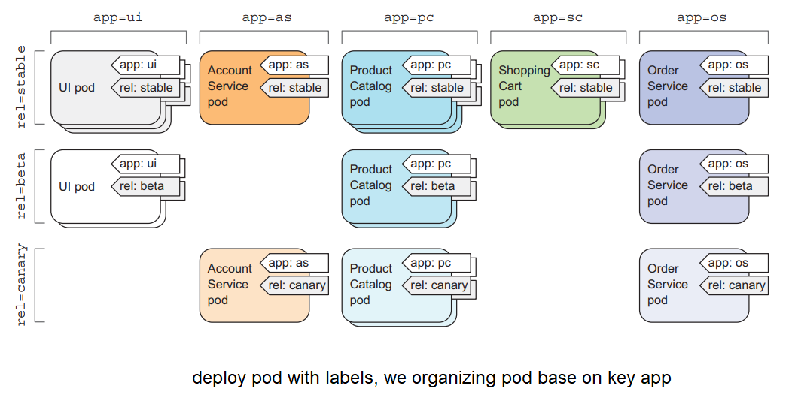

# Kubernetes Pod: thành phần để chạy container
## 1. Kubernetes Pod là gì?

Pod là thành phần cơ bản nhất để deploy và chạy một ứng dụng, được tạo và quản lý bởi kubernetes. Pod được dùng để nhóm (group) và chạy một hoặc nhiều container lại với nhau trên cùng một worker node, những container trong một pod sẽ chia sẻ chung tài nguyên với nhau. **Thông thường chỉ nên run Pod với 1 container** (mình sẽ giải thích về việc khi nào nên chạy một pod một container và một pod nhiều container ở bài khác).


Vậy tại sao là lại dùng Pod để chạy container, sao không chạy container trực tiếp? Kubernetes Pod như một wrapper của container, cung cấp cho chúng ta thêm nhiều chức năng để quản lý và chạy một container, giúp container của ta chạy tốt hơn là chạy container trực tiếp, như là group tài nguyên của container, check container healthy và restart, chắc chắn ứng dụng trong container đã chạy thì mới gửi request tới container đó, cung cấp một số lifecycle để ta có thể thêm hành động vào Pod khi Pod chạy hoặc shutdown, v...v... Và kubernetes sẽ quản lý Pod thay vì quản lý container trực tiếp.


## 2. Chạy ứng dụng đầu tiên bằng Pod

Bây giờ ta bắt tay vào thực hành bài đầu tiên nào.
Đầu tiên ta tạo một folder `docker-images/javascript` và tạo một file index.js, copy đoạn code sau vào:

```
const http = require("http");

const server = http.createServer((req, res) => {
  res.end("Hello kube\n")
});

server.listen(3000, () => {
  console.log("Server listen on port 3000")
})
```

Tạo file `Dockerfile` và copy đoạn code sau vào:

```
FROM node:12-alpine
WORKDIR /app
COPY index.js .
ENTRYPOINT [ "node", "index" ]
```

Run câu lệnh build image:
```
docker build docker-images -t 080196/hello-kube
```

Test thử container có chạy đúng hay không, chạy container bằng câu lệnh:
```
docker run -d --name hello-kube -p 3000:3000 080196/hello-kube
```

Gửi request tới container:
```
curl localhost:3000
>> Hello kube
```

Nếu in ra được chữ hello kube là container của chúng ta đã chạy được. Xóa container đi nhé

```
docker rm -f hello-kube
```

Tạo một file tên là `hello-kube.yaml` trong folder 'hello-kube' và với nội dung như sau:
```
apiVersion: v1 # Descriptor conforms to version v1 of Kubernetes API
kind: Pod # Select Pod resource
metadata:
  name: hello-kube # The name of the pod
spec:
  containers:
    - image: 080196/hello-kube # Image to create the container
      name: hello-kube # The name of the container
      ports:
        - containerPort: 3000 # The port the app is listening on 
          protocol: TCP

```

> NOTE: \
Thường thì ta sẽ không chạy Pod trực tiếp như thế này, mà sẽ sử dụng các resource khác của kube để chạy Pod, mình sẽ nói ở các bài viết sau.

Dùng kubectl CLI (nếu bạn đã cài kubernetes local thì kubectl CLI sẽ có sẵn) để chạy file config của Pod
```
kubectl apply -f hello-kube
```

Kiểm tra pod đã chạy hay chưa
```
kubectl get pod
>> 
    NAME         READY   STATUS    RESTARTS   AGE
    hello-kube   1/1     Running   0          3m37s
```

Nếu cột status hiện `Running` là Pod của bạn đã được chạy thành công, status `ContainerCreating` là Pod đang được tạo. Tiếp theo chúng ta sẽ test pod xem nó chạy đúng hay không. Trước hết để test Pod, ta phải expose traffic của Pod để nó có thể nhận request trước, vì hiện tại Pod của chúng ta đang chạy trong local cluster và không có expose port ra ngoài.

Có 2 cách để expose port của pod ra ngoài, dùng Service resource (mình sẽ nói về Service ở bài sau) hoặc dùng `kubectl port-forward`. Ở bài này chúng ta sẽ dùng port-forward, chạy câu lệnh sau để expose port của pod.

```
kubectl port-forward pod/hello-kube 3000:3000
>> 
    Forwarding from 127.0.0.1:3000 -> 3000
    Forwarding from [::1]:3000 -> 3000
```


Test gửi request tới pod

Nếu in ra được chữ `hello kube` thì pod của chúng ta đã chạy đúng. Sau khi chạy xong để clear resource thì chúng ta xóa pod bằng câu lệnh

```
kubectl delete pod hello-kube
```

## 3. Tổ chức pod bằng cách sử dụng labels

Dùng label là cách để chúng ta có thể phân chia các pod khác nhau tùy thuộc vào dự án hoặc môi trường. Ví dụ công ty của chúng ta có 3 môi trường là testing, staging, production, nếu chạy pod mà không có đánh label thì chúng ta rất khó để biết pod nào thuộc môi trường nào.




Labels là một thuộc tính cặp key-value mà chúng ta gán vào resource ở phần metadata, ta có thể đặt tên key và value với tên bất kì. Ví dụ:

```
apiVersion: v1
kind: Pod
metadata:
  name: hello-kube-testing
  labels:
    enviroment: testing # label with key is enviroment and value is testing
    project: kubernetes-series
spec:
  containers:
    - image: 080196/hello-kube
      name: hello-kube
      ports:
        - containerPort: 3000
          protocol: TCP

---
apiVersion: v1
kind: Pod
metadata:
  name: hello-kube-staging
  labels:
    enviroment: staging # label with key is enviroment and value is staging
    project: kubernetes-series
spec:
  containers:
    - image: 080196/hello-kube
      name: hello-kube
      ports:
        - containerPort: 3000
          protocol: TCP

---
apiVersion: v1
kind: Pod
metadata:
  name: hello-kube-production
  labels:
    enviroment: production # label with key is enviroment and value is production
    project: kubernetes-series
spec:
  containers:
    - image: 080196/hello-kube
      name: hello-kube
      ports:
        - containerPort: 3000
          protocol: TCP

```

Chạy pod với label
```
kubectl apply -f hello-kube/hello-kube-with-label.yaml
```

Ta có thể list pod với labels như sau
```
kubectl get pod --show-labels
>>
    NAME                    READY   STATUS    RESTARTS   AGE   LABELS
    hello-kube-production   1/1     Running   0          20s   enviroment=production,project=kubernetes-series
    hello-kube-staging      1/1     Running   0          20s   enviroment=staging,project=kubernetes-series
    hello-kube-testing      1/1     Running   0          20s   enviroment=testing,project=kubernetes-series
```

Ta có thể chọn chính xác cột label hiển thị với -L options
```
kubectl get pod -L enviroment
>>
    NAME                    READY   STATUS    RESTARTS   AGE   ENVIROMENT
    hello-kube-production   1/1     Running   0          61s   production
    hello-kube-staging      1/1     Running   0          61s   staging
    hello-kube-testing      1/1     Running   0          61s   testing
```

Và ta có thể lọc pod theo label với -l options
```
kubectl get pod -l enviroment=production
>>
    NAME                    READY   STATUS    RESTARTS   AGE
    hello-kube-production   1/1     Running   0          4m51s
```
Label là một cách rất hay để chúng ta có thể tổ chức pod theo chúng ta muốn và dễ dàng quản lý pod giữa các môi trường và dự án khác nhau. Để clear resource thì chúng ta xóa pod đi nhé
```
kubectl delete -f hello-kube/hello-kube-with-label.yaml
```

## 4. Phân chia tài nguyên của kubernetes cluster bằng cách sử dụng namespace 
Tới phần này ta đã biết cách chạy pod và dùng labels để tổ chức pod, nhưng ta chưa có phân chia tài nguyên giữa các môi trường và dự án khác nhau. Ví dụ trong một dự án thì ta muốn tài nguyên của production phải nhiều hơn của testing, thì ta làm thế nào? Chúng ta sẽ dùng **namespace**.

Namespace là cách để ta chia tài nguyên của cluster, và nhóm tất cả những resource liên quan lại với nhau, bạn có thể hiểu namespace như là một sub-cluster. Đầu tiên chúng ta list ra toàn bộ namespace.

```
kubectl get ns
```
Ta sẽ thấy có vài namespace đã được tại bởi kube, trong đó có namespace tên là `default`, `kube-system`. Namespace `default` là namespace chúng ta đang làm việc với nó, khi ta sử dụng câu lệnh kubectl get để hiển thị resource, nó sẽ hiểu ngầm ở bên dưới là ta muốn lấy resource của namespace mặc định. Ta có thể chỉ định resource của namespace chúng ta muốn bằng cách thêm option --namespace vào.
```
kubectl get pod --namespace kube-system
>>
  NAME                               READY   STATUS    RESTARTS        AGE
  coredns-6d4b75cb6d-4cxtn           1/1     Running   1 (14h ago)     20h
  etcd-minikube                      1/1     Running   1 (14h ago)     20h
  kube-apiserver-minikube            1/1     Running   1 (14h ago)     20h
  kube-controller-manager-minikube   1/1     Running   1 (14h ago)     20h
  kube-proxy-8bwhm                   1/1     Running   1 (14h ago)     20h
  kube-scheduler-minikube            1/1     Running   1 (6m31s ago)   20h
  storage-provisioner                1/1     Running   3 (5m40s ago)   20h
```

Bây giờ ta sẽ thử tạo một namespace và tạo pod trong namespace đó. Cách tổ chức namespace tốt là tạo theo `<project_name>:<enviroment>`. Ví dụ: mapp-testing, mapp-staging, mapp-production, kala-testing, kala-production. Ở đây làm nhanh thì mình sẽ không đặt namespace theo cách trên
```
kubectl create ns testing
```
Tạo file `hello-kube-namespace.yaml` với nội dung sau:
```
apiVersion: v1
kind: Pod
metadata:
  name: hello-kube-testing
  namespace: testing # namespace name
spec:
  containers:
    - image: 080196/hello-kube
      name: hello-kube
      ports:
        - containerPort: 3000
          protocol: TCP

```

Tạo pod
```
kubectl apply -f hello-kube/hello-kube-namespace.yaml
```

Bây giờ nếu ta list pod mà không chỉ định namespace testing, ta sẽ không thấy pod nào cả 
```
kubectl get pod
>>
  No resources found in default namespace.
```
Để list pod, ta phải chỉ định thêm namespace chúng ta muốn lấy
```
kubectl get pod -n testing
>>
  NAME                 READY   STATUS    RESTARTS   AGE
  hello-kube-testing   1/1     Running   0          2m19s
```
Vậy là ta đã tạo pod trong namespace testing thành công, xóa pod đi nhé, khi xóa thì ta cũng cần chỉ định namespace chứa resource của chúng ta.
```
kubectl delete pod hello-kube-testing -n testing
```

>NOTE: Bạn cũng có thể xóa namespace bằng cách dùng câu lệnh delete, **chú ý là khi xóa namespace thì toàn bộ resource trong đó cũng sẽ bị xóa theo**.

## 5. Kết luận

Vậy là ta đã thành công chạy ứng dụng đâu tiên trên kubernetes bằng cách sử dụng Pod. Pod là thành phần đơn giản nhất và là một thành phần chính của kubernetes để chạy container, những thành phần khác của kubernetes chỉ đóng vai trò hỗ trợ để chạy Pod, giúp pod chạy ngon hơn trong việc deploy. Cảm ơn các bạn đã đọc bài của mình. Nếu có thắc mắc hoặc cần giải thích rõ thêm chỗ nào thì các bạn có thể hỏi dưới phần comment. Hẹn gặp lại các bạn ở bài tiếp theo mình sẽ nói về  `Kubernetes ReplicationController`, `ReplicaSet` hoặc `Kubernetes Services`.