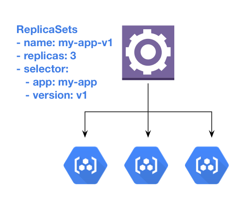
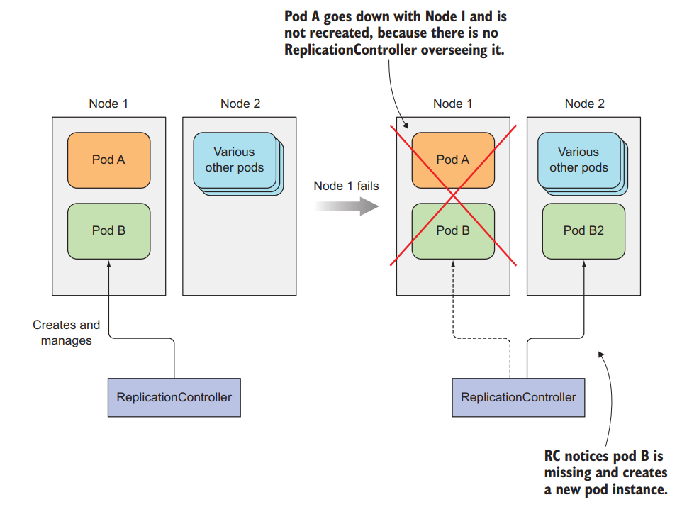
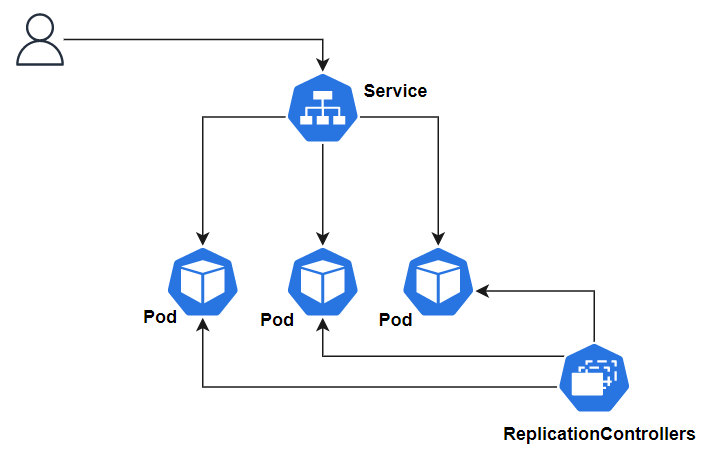
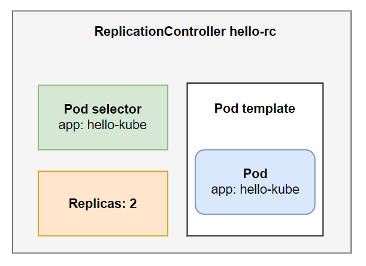
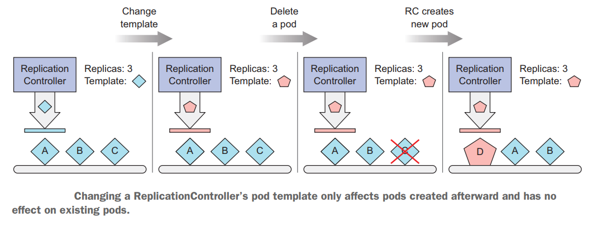
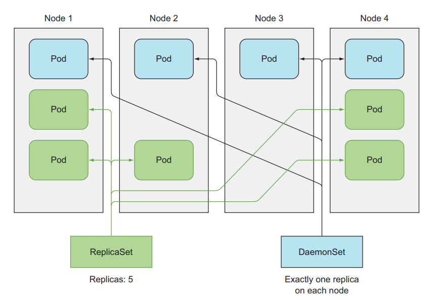
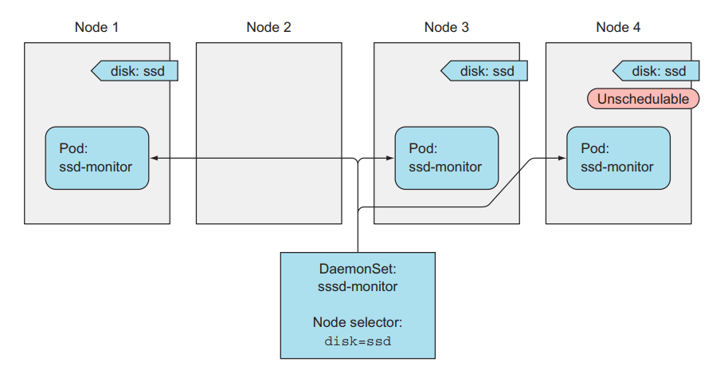

# ReplicationControllers, ReplicaSets và DaemonSets

## 1. Giới thiệu

Chào các bạn tới với series về kubernetes. Đây là bài thứ ba trong series của mình, trong bài này mình sẽ nói về  `Kubernetes ReplicationControllers`, `ReplicaSets`, `DaemonSet`. Như chúng ta đã biết pod là thành phần cơ bản nhất để deploy application, nhưng trong thực tế ta sẽ không chạy pod trực tiếp, vì nó sẽ gặp nhiều hạn chế, mà chúng ta sẽ tạo những resource khác như ReplicationControllers hoặc ReplicaSets, và nó sẽ tự động tạo và quản lý pod.

## 2. ReplicationControllers là gì?

ReplicationControllers là một resource mà sẽ tạo và quản lý pod, và chắc chắn là số lượng pod nó quản lý không thay đổi và kept running. ReplicationControllers sẽ tạo số lượng pod bằng với số ta chỉ định ở thuộc tính replicas và quản lý pod thông qua labels của pod.


### 2.1 Tại sao ta nên dùng ReplicationControllers để chạy pod?

Chúng ta đã biết pod nó sẽ giám sát container và tự động restart lại container khi nó fail.
Vậy trong trường hợp toàn bộ worker node của chúng ta fail thì sẽ thế nào? pod nó sẽ không thể chạy nữa, và application của chúng ta sẽ downtime với người dùng.


Nếu chúng ta chạy cluster với hơn 1 worker node, RC sẽ giúp chúng ta giải quyết vấn đề này. Vì RC sẽ chắc chắn rằng số lượng pod mà nó tạo ra không thay đổi, nên ví dụ khi ta tạo một thằng RC với số lượng replicas = 1, RC sẽ tạo 1 pod và giám sát nó, khi một thằng worker node die, nếu pod của thằng RC quản lý có nằm trong worker node đó, thì lúc này thằng RC sẽ phát hiện ra là số lượng pod của nó bằng 0, và nó sẽ tạo ra thằng pod ở một worker node khác để đạt lại được số lượng 1.



Sử dụng ReplicationControllers để chạy pod sẽ giúp ứng dụng của chúng ta luôn luôn availability nhất có thể. Ngoài ra ta có thể tăng performance của ứng dụng bằng cách chỉ định số lượng replicas trong RC để RC tạo ra nhiều pod chạy cùng một version của ứng dụng.

Ví dụ ta có một webservice, nếu ta chỉ deploy một pod để chạy ứng dụng, thì ta chỉ có 1 container để xử lý request của user, nhưng nếu ta dùng RC và chỉ định replicas = 3, ta sẽ có 3 pod chạy 3 container của ứng dụng, và request của user sẽ được gửi tới 1 trong 3 pod này, giúp quá trình xử lý của chúng ta tăng gấp 3 lần.



## 3. Tạo một ReplicationControllers

Vậy là xong phần lý thuyết, chúng ta bắt tay vào phần thực hành nào. Tạo một file tên là hello-kube-rc.yaml với nội dung như sau:

```
apiVersion: v1
kind: ReplicationController
metadata:
  name: hello-rc
spec:
  replicas: 2 # number of the pod
  selector: # The pod selector determining what pods the RC is operating on
    app: hello-kube # label value
  template: # pod template
    metadata:
      labels:
        app: hello-kube # label value
    spec:
      containers:
      - image: 080196/hello-kube # image used to run container
        name: hello-kube # name of the container
        ports:
          - containerPort: 3000 # pod of the container
```

Cấu trúc của một file config RC sẽ gồm 3 phần chính như sau:

- `label selector`: sẽ chỉ định pod nào sẽ được RC giám sát
- `replica count`: số lượng pod sẽ được tạo
- `pod template`: config của pod sẽ được tạo



Bây giờ ta tạo RC nào
```
kubectl apply -f hello-kube/hello-kube-rc.yaml
```
Kiểm tra xem rc của chúng ta đã chạy thành công hay chưa
```
kubectl get pod
>>
  NAME             READY   STATUS    RESTARTS   AGE
  hello-rc-7ph5c   1/1     Running   0          103s
  hello-rc-vqdr8   1/1     Running   0          103s
```

Ở đây thì tên pod của bạn hiển thị sẽ khác với trong hình nhé, nếu bạn thấy có 2 pod thì số lượng pod được tạo ra bởi RC đã chính xác, tên của pod được tạo ra bởi RC sẽ theo kiểu `<replicationcontroller name>-<random>`. Giờ ta sẽ xóa thử một thằng pod xem RC có tạo lại một thằng pod khác cho chúng ta như lý thuyết không. Nhớ chỉ định đúng tên pod của bạn.
```
kubectl delete pod hello-rc-7ph5c
kubectl get pod
>>
  hello-rc-kfbsk   1/1     Running   0          34s
  hello-rc-vqdr8   1/1     Running   0          3m25s
```
Bạn sẽ thấy là có một thằng cũ đang bị xóa đi, và cũng lúc đó, sẽ có một thằng pod mới được RC tạo ra, ở đây pod mới của mình tên là `hello-rc-kfbsk`. Hoạt động của thằng RC được mình họa như hình sau:


### 3.1 Thay đổi template của pod

Bạn có thể thay đổi template của pod và cập nhật lại RC, nhưng nó sẽ không apply cho những thằng pod hiện tại, muốn pod của bạn cập nhật template mới, bạn phải xóa hết pod để RC tạo ra pod mới, hoặc xóa RC và tạo lại.



Vậy là chúng ta đã chạy được RC, bây giờ ta xóa đi nhé, để xóa RC thì các bạn dùng câu lệnh
```
kubectl delete rc hello-rc
kubectl get pod
>>
  NAME             READY   STATUS        RESTARTS   AGE
  hello-rc-kfbsk   1/1     Terminating   0          4m23s
  hello-rc-vqdr8   1/1     Terminating   0          7m14s
```
Khi bạn xóa RC thì những thằng pod nó quản lý cũng sẽ bị xóa theo

## 4. Sử dụng ReplicaSets thay thế RC

Đây là một resource tương tự như RC, nhưng nó là một phiên bản mới hơn của RC và sẽ được sử dụng để thay thế RC. Chúng ta sẽ dùng ReplicaSets (RS) để deploy pod thay vì dùng RC, ở bài này mình nói về RC trước để chúng ta hiểu được nguồn gốc của nó, để đi phỏng vấn có bị hỏi vẫn biết trả lời 😁.

Bây giờ ta sẽ tạo thử một thằng RS, config nó vẫn giống RC, chỉ khác một vài phần. Tạo file tên là `hello-kube-rs.yaml` với nội dung sau:
```
apiVersion: apps/v1 # change version API
kind: ReplicaSet # change resource name
metadata:
  name: hello-rs
spec:
  replicas: 2
  selector:
    matchLabels: # change here 
      app: hello-kube
  template:
    metadata:
      labels:
        app: hello-kube
    spec:
      containers:
      - image: 080196/hello-kube
        name: hello-kube
        ports:
          - containerPort: 3000
```

```
kubectl apply -f hello-kube/hello-kube-rs.yaml
```

Kiểm tra RS của chúng ta có chạy thành công hay không
```
kubectl get rs
kubectl get pod
>>
  NAME             READY   STATUS    RESTARTS   AGE
  hello-rs-lmpbd   1/1     Running   0          20s
  hello-rs-zx7p9   1/1     Running   0          20s
```

Nếu có 2 pod tạo ra là chúng ta đã chạy RS thành công. Đề xóa RS ta dùng câu lệnh
```
kubectl delete rs hello-rs
```

### 4.1. So sánh ReplicaSets và ReplicationController

RS và RC sẽ hoạt động tương tự nhau. Nhưng RS linh hoạt hơn ở phần label selector, trong khi label selector thằng RC chỉ có thể chọn pod mà hoàn toàn giống với label nó chỉ định, thì thằng RS sẽ cho phép dùng một số expressions hoặc matching để chọn pod nó quản lý.

Ví dụ, thằng RC không thể nào match với pod mà có `env=production` và `env=testing` cùng lúc được, trong khi thằng RS có thể, bằng cách chỉ định label selector như `env=* `. Ngoài ra, ta có thể dùng operators với thuộc tính matchExpressions như sau:
```
selector:
  matchExpressions:
    - key: app
      operator: In
      values:
        - kubia
```
Có 4 operators cơ bản là: `In`, `NotIn`, `Exists`, `DoesNotExist`

## 5. Sử dụng `DaemonSets` để chạy chính xác một pod trên một worker node

Đây là một resource khác của kube, giống như RS, nó cũng sẽ giám xác và quản lý pod theo lables. Nhưng thằng RS thì pod có thể deploy ở bất cứ node nào, và trong một node có thể chạy mấy pod cũng được. Còn thằng DaemonSets này sẽ deploy tới mỗi thằng node một pod duy nhất, và chắc chắn có bao nhiêu node sẽ có mấy nhiêu pod, nó sẽ không có thuộc tính replicas.



Ứng dụng của thằng DaemonSets này sẽ được dùng trong việc logging và monitoring. Lúc này thì chúng ta sẽ chỉ muốn có một pod monitoring ở mỗi node. Và ta cũng có thể đánh label vào trong một thằng woker node bằng cách sử dụng câu lệnh

`kubectl label nodes <your-node-name> disk=ssd`

Sau đó ta có thể chỉ định thêm vào config của DaemonSets ở cột nodeSelector với disk=ssd. Chỉ deploy thằng pod trên node có ổ đĩa ssd. Đây là config ví dụ.

```
apiVersion: apps/v1
kind: DaemonSet
metadata:
  name: ssd-monitor
spec:
  selector:
    matchLabels:
      app: ssd-monitor
  template:
    metadata:
      labels:
        app: ssd-monitor
    spec:
      nodeSelector:
        disk: ssd
      containers:
        - name: main
          image: luksa/ssd-monitor

```



Ở đây thì chúng ta sẽ không thực hành tạo DaemonSets vì chúng ta cần môi trường có nhiều worker node để demo resource này. Các bạn có thể đọc nhiều hơn về DaemonSets ở [đây](https://kubernetes.io/docs/concepts/workloads/controllers/daemonset/)