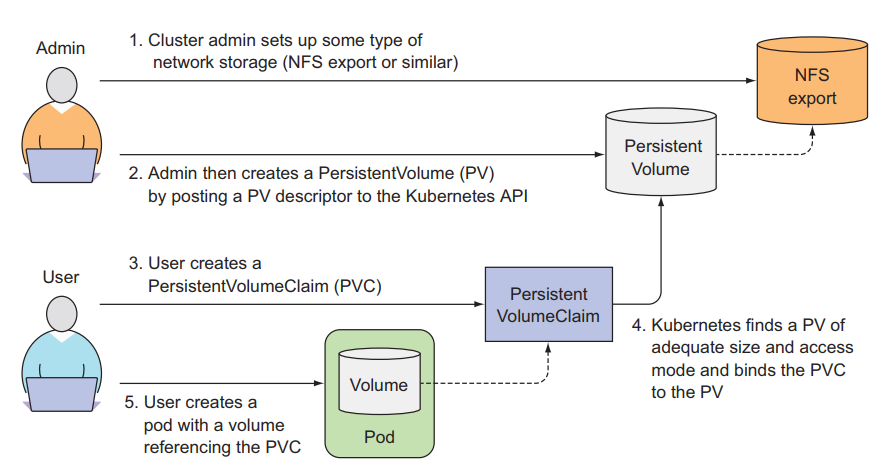
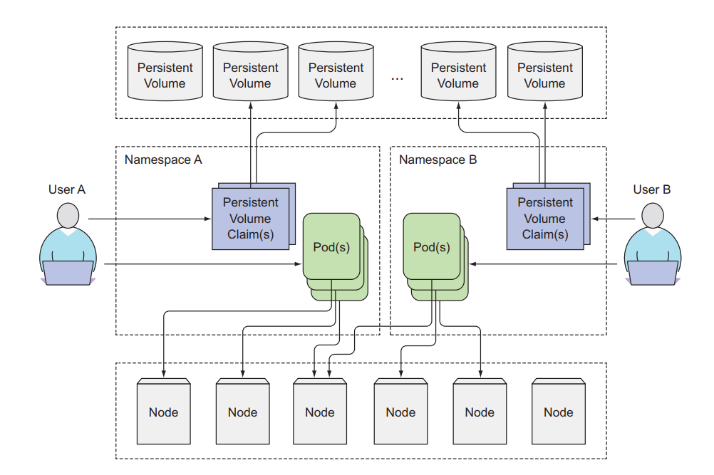
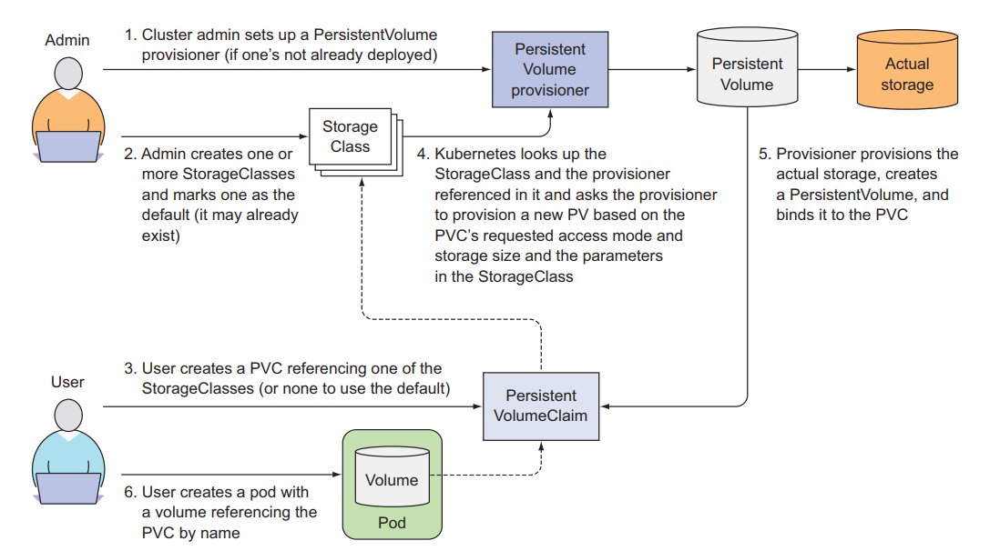

# PersistentVolumeClaims: tách Pod ra khỏi kiến trúc storage bên dưới
## 1. Giới thiệu
Ở bài này chúng ta sẽ nói về PersistentVolumeClaims, một loại của volume mà giúp ta tách Pod ra khỏi storage technology bên dưới.

Tất cả những loại volume ta nói ở bài trước đều đòi hỏi developer phải biết về kiến trúc storage bên dưới của worker node. Ví dụ, ta muốn tạo một hostpath volume, ta cần phải biết hostpath dẫn tới folder nào của worker node, ta muốn tạo một awsElasticBlockStore volume, ta cần phải biết EBS name. Thì đối với một developer mà cần deploy ứng dụng có sử dụng volume trong kubernetes, cái ta muốn biết chỉ là size của volume, còn ở bên dưới volume nó xài kiến trúc storage nào thì ta không quan tâm lắm, ta không muốn ta cần phải chỉ định là Pod sẽ xài hostpath volume hoặc là awsElasticBlockStore, ta chỉ muốn quan tâm size mà thôi.

Thì để làm được việc đó thì kubernetes cung cấp cho cúng ta 2 resource là **PersistentVolumeClaims**, **PersistentVolumes**.

## 2. PersistentVolumeClaims, PersistentVolumes

Với PersistentVolumes là resource sẽ tương tác với kiến trúc storage bên dưới, và PersistentVolumeClaims sẽ request storage từ PersistentVolumes, tương tự như Pod. Pods tiêu thụ node resources và PersistentVolumeClaims tiêu thụ PersistentVolumes resources.

Thông thường khi làm việc với kubernetes ta sẽ có 2 role là:

- kubernetes administrator: người dựng và quản lý kubernetes cluster, cài những plugin và addons cần thiết cho kubernetes cluster.
- kubernetes developer: người mà sẽ viết file config yaml để deploy ứng dụng lên trên kubernetes.

Một kubernetes administrator sẽ setup kiến trúc storage bên dưới và tạo PersistentVolumes để cho kubernetes developer request và xài.



## 2.1 Tạo PersistentVolumes

Bây giờ ta sẽ là một cluster administrator và ta cần tạo PersistentVolume để cho cluster developer có thể request và xài. Tạo một file tên `mongodb-pv.yaml` với config như sau:
```
apiVersion: v1
kind: PersistentVolume
metadata:
  name: mongodb-pv
spec:
  storageClassName: manual
  capacity:
    storage: 10Gi # size of the storage
  accessModes: # access mode
    - ReadWriteOnce # can be mounted by a single wokrer node for reading and writing
    - ReadOnlyMany # can be mounted by a multiple wokrer node for reading only
  hostPath:
    path: "/mnt/data"
```
Khi cluster administrator tạo một PV, ta cần chỉ định size của PV này là bao nhiêu, và cần chỉ định access modes của nó, có thể được đọc và ghi bởi một node hay nhiều node. Ở ví dụ trên, thì chỉ có 1 node có quyền ghi vào PV này, còn nhiều node khác có quyền đọc từ PV này, kiến trúc storage của PV này xài là gcePersistentDisk, ta đã nói về loại volume này ở bài trước. Ta tạo thử PV ta vừa mới viết là list nó ra xem thử.

```
$ kubectl apply -f mongodb/pv-gcepd.yaml
$ kubectl get pv
>>
    NAME        CAPACITY  RECLAIMPOLICY  ACCESSMODES  STATUS     CLAIM  ...
    mongodb-pv  10Gi      Retain         RWO,ROX      Available
```
Bây giờ thì ta đã có PV. Tiếp theo thì ta sẽ đóng vai cluster developer để tạo PVCs và sẽ tiêu thụ PV này.
> PersistentVolumes sẽ không thuộc về bất kì namespace nào. Trong kubernetes thì có tồn tại 2 loại resource là namespace resource và cluster resource. Như Pod, Deployment thì là namspace resource, khi tạo Pod ta có thể chỉ định thuộc tính namespace và Pod sẽ thuộc về namespace đó, nếu ta không chỉ định namespace thì Pod sẽ thuộc default namespace. Còn cluster resource sẽ không thuộc về namespace nào, như là Node, PersistentVolumes resource.



### 2.2 Tạo PersistentVolumeClaim tiêu thụ PersistentVolumes

Bây giờ ta là developer, ta cần deploy Pod mà cần xài volume để lưu trữ persistent data. Tạo một file tên là `mongodb-pvc.yaml` với config như sau:
```
apiVersion: v1
kind: PersistentVolumeClaim
metadata:
  name: mongodb-pvc
spec:
  resources:
    requests:
      storage: 5Gi # request 5Gi storage
  accessModes:
    - ReadWriteOnce # only allow one node can be read and write
  storageClassName: "manual"
```
Ở đây ta sẽ tạo một PVC tên là mongodb-pvc mà request 10Gi storage, nếu có PV nào đáp ứng được nó, thì PVCs này sẽ tiêu thụ storage của PV đó. Và thằng PV này chỉ cho phép một thằng worker node có quyền đọc và ghi vào nó. Ở đây có một thuộc tính storageClassName ta chỉ định là rỗng, ta sẽ nói về thuộc tính này ở phần dưới. Tạo PVCs và list nó ra xem thử.
```
$ kubectl apply -f mongodb/mongodb-pvc.yaml
$ kubectl get pvc
>>
    NAME         STATUS  VOLUME      CAPACITY  ACCESSMODES  AGE
    mongodb-pvc  Bound   mongodb-pv  10Gi       RWO,ROX      3s
```
Ta thấy status của PV đã chuyển thành Bound và cột CLAIM đã hiển thị PVCs đang tiêu thụ nó.

### 2.3 Tạo Pod sử dụng PersistentVolumeClaim

Bây giờ ta sẽ tạo Pod xài PVCs, tạo một file tên là `mongodb-pod-pvc.yaml` với config như sau:
```
apiVersion: v1
kind: Pod
metadata:
  name: mongodb
spec:
  containers:
    - image: mongo
      name: mongodb
      volumeMounts:
        - name: mongodb-data
          mountPath: /usr/data/db
      ports:
        - containerPort: 27017
          protocol: TCP
  volumes:
    - name: mongodb-data
      persistentVolumeClaim:
        claimName: mongodb-pvc # specify PVCs we want to use
```
Để sử dụng PVCs, ta chỉ định nó trong thuộc tính volumes của Pod, thì mỗi PVCs tại một thời điểm chỉ có thể được xài bởi một Pod. Giờ ta thử tạo Pod và test, các bạn nhớ là ở bài trước ta đã tạo một gcePersistentDisk và insert dữ liệu vào trong đó chứ.
```
kubectl create -f mongodb/mongodb-pod-pvc.yaml

kubectl exec pod/mongodb -- ls -l /usr/data/db
>>
    total 4
    drwx------ 2 mongodb mongodb 4096 Mar  7 09:18 journal
    -rw------- 1 mongodb mongodb    0 Mar  7 09:18 mongod.lock
```
### 2.4 Lợi ích của việc xài PersistentVolumeClaim

Trong bài viết này thì các bạn sẽ thấy so sánh với volume thì xài PersistentVolumeClaim ta cần làm nhiều bước hơn. Nhưng với góc nhìn của developer khi làm thực tế thì bây giờ ta chỉ cần tạo PVCs và chỉ định size của nó, sau đó trong Pod ta chỉ cần chỉ định tên của PVCs, ta không cần phải làm việc với kiến trúc storage bên dưới node của ta, và ta cũng chả cần biết là dữ liệu ta được lưu ở worker node hay là ở storage của cloud hay là ở chỗ khác. Những thứ đó là việc của cluster administrator.

Và file config của PVCs ta có thể xài lại ở những cluster khác được, trong khi ta xài volume thì ta cần phải xem là cluster đó hỗ trợ những kiến trúc storage nào trước, nên một file config có thể khó xài được ở những cluster khác nhau.

## 3. Recycling PersistentVolumes

Khi tạo PV thì ta để ý có một thuộc tính là persistentVolumeReclaimPolicy, thuộc tính này sẽ định nghĩa hành động của PV như thế nào khi PVCs bị xóa đi, có 3 mode là:

- Retain
- Recycle
- Delete

Ở mode Retain policy, khi ta delete PVCs thì PV của ta vẫn tồn tại ở đó, nhưng nó PV sẽ ở trạng thái là Release chứ không phải Available như ban đầu, vì nó đã được sử dụng bởi PVCs và chứa dữ liệu rồi, nếu để thằng PVCs bound vào thì có thể gây ra lỗi, dùng mode này khi ta muốn lỡ có ta có xóa PVCs thì dữ liệu của ta vẫn con đó, việc ta cần làm là xóa PV bằng tay, tạo ra PV mới là tạo ra PVCs mới để bound vào lại.

Ta xóa thử thằng PVCs.
```
$ kubectl delete pod mongodb
>>  pod "mongodb" deleted
$ kubectl delete pvc mongodb-pvc
>>  persistentvolumeclaim "mongodb-pvc" deleted
$ kubectl get pv
>>
    NAME        CAPACITY  ACCESSMODES  STATUS    CLAIM              
    mongodb-pv  10Gi      RWO,ROX      Released  default/mongodb-pvc
```

Ở mode Recycle policy, khi ta delete PVCs thì PV của ta vẫn tồn tại ở đó, nhưng lúc này dữ liệu trong PV sẽ bị xóa đi luôn và trạng thái sẽ là Available để cho một thằng PVCs khác có thể tiêu thụ nó.
Ta có thể thay đổi policy của một thằng PV đang có, như là chuyển từ `Delete` sang `Retain` để tránh mất dữ liệu.

## 4. Tự động cấp PersistentVolumes (Dynamic provisioning)

Ta đã thấy cách sử dụng PV và PVCs với nhau để developer không cần làm việc với kiến trúc storage bên dưới. Nhưng ta vẫn cần một administrator setup những thứ đó trước. Để tránh việc đó thì Kubernetes có cung cấp ta một cách để tự động tạo PV bên dưới.

>Cách mà administrator setup trước gọi là Pre provisioning, còn cách tự động gọi là Dynamic provisioning.

Để làm được việc này thì ta sẽ sử dụng StorageClasses với một provisioner (được cloud hỗ trợ mặc định), còn các môi trường không phải cloud thì ta phải cài provisioner.

### 4.1 Tạo StorageClass

Đây là resource sẽ tự động tạo PV cho ta, ta chỉ cần tạo StorageClass một lần, thay vì phải config và tạo một đống PV. Tạo một file tên là storageclass-fast-gcepd.yaml với config như sau:
```
kind: StorageClass
apiVersion: storage.k8s.io/v1
metadata:
  namespace: kube-system
  name: fast
  annotations:
    storageclass.kubernetes.io/is-default-class: "true"
  labels:
    addonmanager.kubernetes.io/mode: EnsureExists

provisioner: k8s.io/minikube-hostpath
```

Ở đây ta tạo một StorageClass tên là fast, sử dụng `k8s.io/minikube-hostpath` provisioner mà sẽ giúp ta tự động tạo PV bên dưới. Khi ta tạo một PVCs, ta sẽ chỉ định `storageClassName` là `fast`. Lúc này thì PVCs ta sẽ request tới StorageClass, và StorageClass sẽ tự động tạo một thằng PV bên dưới cho PVCs xài.

Tạo một file tên là `mongodb-pvc-dp.yaml` với config như sau:
```
apiVersion: v1
kind: PersistentVolumeClaim
metadata:
  name: mongodb-pvc
spec:
  storageClassName: fast # This PVC use fast StorageClass
  resources:
    requests:
      storage: 100Mi
  accessModes:
    - ReadWriteOnce
```
```
kubectl apply -f mongodb-pvc-dp.yaml

kubectl get pv
>>
    NAME          CAPACITY   ACCESS MODES   RECLAIM POLICY   STATUS     CLAIM                 STORAGECLASS ...
    mongodb-pv    10Gi       RWO,ROX        Retain           Released   default/mongodb-pvc   manual         
    pvc-8297194b  100Mi      RWO            Delete           Bound      default/mongodb-pvc   fast           
```
Ta sẽ thấy có một thằng `pvc-8297194b` tự động được StorageClass tạo ra.


### 4.2 Dynamic provisioning mà không cần chỉ định storage class

Khi ta không chỉ định thuộc tính storageClassName trong PVCs thì nó sẽ xài storage class mặc định. Ta list thử storage class ra.
```
kubectl get sc
>>
    AME                 PROVISIONER                RECLAIMPOLICY   VOLUMEBINDINGMODE  ...
    fast (default)       k8s.io/minikube-hostpath   Delete          Immediate                          
    standard (default)   k8s.io/minikube-hostpath   Delete          Immediate                         
```

```
apiVersion: v1
kind: PersistentVolumeClaim
metadata:
  name: mongodb-pvc
spec:
  resources:
    requests:
      storage: 100Mi
  accessModes:
    - ReadWriteOnce

```
Như ở file config trên, ta không chỉ định thuộc tính `storageClassName`, nên PVCs này sẽ mặc định xài `standard` storageClassName.

## 5. Kết luận
Vậy là ta đã tìm hiểu xong PersistentVolumeClaims, loại volume giúp ta tách Pod ra khỏi việc phải config volume với kiến trúc storage bên dưới.