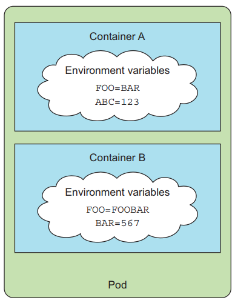
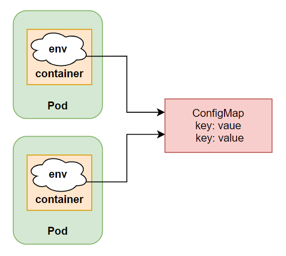
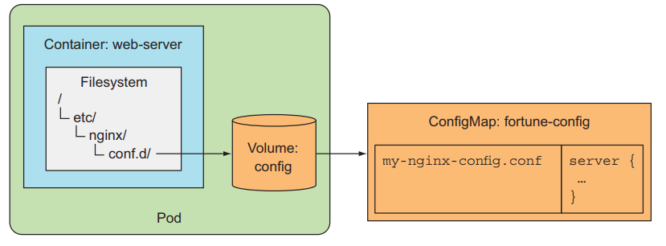

# ConfigMap and Secret: truyền cấu hình vào container 
## 1. Giới Thiệu
Ở bài này mình ta sẽ nói về cách để truyền cấu hình (configuration) của ứng dụng vào bên trong container, bằng cách sử dụng **ConfigMap**. Và truyền sensitive data bằng **Secret**.

Hầu hết các ứng dụng của chúng ta đều cần configuration để chạy. Như là configuration của database, configuration PORT của ứng dụng. Thì trước khi nói về cách dùng ConfigMaps và Secrets. Ta sẽ xem cách ta truyền configuration vào container như thế nào trong Pod.

## 2. Chỉ định biến môi trường cho container
Thì cấu hình của ứng dụng trong một container thường được truyền thông qua biến môi trường (environment variables - viết tắt env).



Kubernetes có cung cấp cho chúng ta cách truyền một list env vào bên trong từng container của Pod. Ví dụ, ta có một image `080196/hello-env` với code như sau:
```
const http = require("http");

const server = http.createServer((req, res) => {
  console.log("Hello env\n")
});

server.listen(process.env.PORT, () => {
  console.log("Server listen on port ", process.env.PORT)
})
```
Trong image này ta có cấu hình PORT của ứng dụng sẽ được truyền vào bên trong container thông qua env PORT. Tạo một file tên là `pod-hello-env.yaml` với config như sau:
```
apiVersion: v1
kind: Pod
metadata:
  name: hello-env
spec:
  containers:
    - image: 080196/hello-env
      name: hello-env
      ports:
        - containerPort: 3000
      env: # pass env to container
        - name: PORT # env name
          value: "3000" # env value
```

Trong file config này, ta có chỉ định một thuộc tính tên là env, đây là thuộc tính của Pod giúp ta truyền env vào bên trong container, với tên của env là PORT và giá trị của nó sẽ là 3000.
>LƯU Ý: là giá trị env luôn là **chuỗi**, nếu bạn để số nó sẽ báo lỗi. 

Giờ ta tạo Pod và kiểm tra log.
```
kubectl apply -f hello-env/pod-hello-env.yaml
kubectl logs hello-env
>> Server listen on port  3000
```

Ở đây thì ứng dụng của chúng ta đã chạy đúng theo PORT mà chúng ta truyền vào container thông qua env. Các bạn có thể kiểm tra kĩ hơn bằng cách truy cập vào container và in ra env của nó như sau:
```
kubectl exec -it pod/hello-env -- sh
/app # env | grep PORT
>> KUBERNETES_PORT=tcp://10.96.0.1:443
>> KUBERNETES_SERVICE_PORT=443
>> PORT=3000
>> KUBERNETES_PORT_443_TCP_ADDR=10.96.0.1
>> KUBERNETES_PORT_443_TCP_PORT=443
>> KUBERNETES_PORT_443_TCP_PROTO=tcp
>> KUBERNETES_SERVICE_PORT_HTTPS=443
>> KUBERNETES_PORT_443_TCP=tcp://10.96.0.1:443

/app # exit
```
>CHÚ Ý: là list env này sẽ không thể update bên trong container khi container đó đã chạy, muốn update thì ta phải xóa Pod đó để nó chạy lại.

Dùng env để truyền configuration vào bên trong container rất dễ dàng, nhưng khi ứng dụng ta càng lớn, cần càng nhiều env hơn, thì ta sẽ nhận ra rằng chỉ định thẳng env trong Pod như thế này có rất nhiều hạn chế. Thứ nhất là file config của ta sẽ cực dài, thứ hai là có một số env ta sẽ sử dụng đi sử dụng lại nhiều lần, thì ta sẽ copy và past nó ở nhiều nơi. Ví dụ như sau:
```
apiVersion: v1
kind: Pod
metadata:
  name: hello-env
spec:
  containers:
    - image: 080196/hello-env
      name: hello-env
      ports:
        - containerPort: 3000
      env:
        - name: PORT
          value: "3000"
        - name: POSTGRES_DB
          value: postgres
        - name: POSTGRES_USER
          value: postgres
        - name: POSTGRES_PASSWORD
          value: postgres

---
apiVersion: v1
kind: Pod
metadata:
  name: postgres
spec:
  containers:
    - image: postgres
      name: postgres
      ports:
        - containerPort: 5432
      env:
        - name: POSTGRES_DB
          value: postgres
        - name: POSTGRES_USER
          value: postgres
        - name: POSTGRES_PASSWORD
          value: postgres
```

Trong file config này ta có 2 Pod, một Pod chạy ứng dụng và một Pod chạy database. Ta sẽ thấy là cấu hình liên quan về thông tin của database sẽ được lập lại 2 lần. Khi ứng dụng ta phình lên thì sẽ còn cần rất nhiều env nữa. Lúc này ta chỉ muốn khai báo configuration chung ở một chỗ thôi, và dùng configuration đó để sử dụng lại nhiều lần. Thì thằng kubernetes cung cấp cho ta một resource để làm việc đó là ConfigMap.

>LƯU Ý: là thông tin về user và password của database là thông tin nhạy cảm (sensitive data), thường với thông tin nhạy cảm ta sẽ không dùng ConfigMap mà sẽ dùng Secret (sẽ nói ở phần dưới), ở đây vì làm ví dụ nên ta sẽ ConfigMap.

## 3. ConfigMap

Đây là một resource giúp chúng ta tách configuration ra riêng. Với giá trị sẽ được định nghĩa theo kiểu key/value pairs ở thuộc tính data, như sau:
```
data:
    <key-1>: <value-1>
    <key-2>: <value-2>
```

Và giá trị này sẽ được truyền vào bên trong container như một env. Và vì ConfigMap nó là một resource riêng lẻ, ta có thể sử dụng nó lại cho nhiều container khác nhau. Sử dụng ConfigMap là cách ta tách khỏi việc phải viết cấu hình env bên trong config container của Pod.



### 3.1 Tạo một ConfigMap

Giờ ta sẽ tạo một ConfigMap. Tạo một file `cm-db.yaml` với cấu hình như sau:
```
apiVersion: v1
kind: ConfigMap
metadata:
  name: postgres-config
data:
  DB: postgres
  USER: postgres
  PASSWORD: postgres
```

Ở đây ta sẽ tạo một ConfigMap tên là postgres-config có 3 key là DB, USER, PASSWORD.
```
kubectl apply -f hello-env/cm-db-hello-env.yaml
>> configmap/postgres-config created
```

Hoặc ta cũng có thể tạo ConfigMap thông qua câu lệnh cli mà không cần viết file config, như sau:
```
$ kubectl create cm postgres-config --from-literal=DB=postgres --from-literal=USER=postgres --from-literal=PASSWORD=postgres
>> configmap/postgres-config created
```
Truyền ConfigMap vào bên trong container. Ta sẽ sửa dụng lại ví dụ ở trên, tạo một file tên pod-with-cm.yaml sửa dụng image `080196/hello-cm`, code của image như sau:
```
const http = require("http");
const { Client } = require("pg");

const { DB_HOST, POSTGRES_USER, POSTGRES_DB, POSTGRES_PASSWORD } = process.env;

const client = new Client({
  host: DB_HOST,
  user: POSTGRES_USER,
  database: POSTGRES_DB,
  password: POSTGRES_PASSWORD,
  port: 5432,
});
client.connect().then(() => {
  console.log("connect db successfully");
})

const server = http.createServer((req, res) => {
  console.log("Hello env\n")
});

server.listen(process.env.PORT, () => {
  console.log("Server listen on port ", process.env.PORT)
})
```

Ở đây ta sẽ dùng thuộc tính envFrom thay vì env để chỉ định sử dụng ConfigMap, trường prefix sẽ nối ở phía trước cho tất cả env của ta với giá trị là POSTGRES_. Như các bạn thấy thay vì ta phải viết lại env ở cả 2 Pod thì ta chỉ cần tạo một configmap rồi sử dụng nó lại nhiều lần. Ta tạo và kiểm tra thử:
```
kubectl apply -f hello-env/pod-hello-env-with-cm.yaml -l app=db
```
Ở đây ta kiểm tra Pod db chạy rồi ta hãy tạo pod hello-cm và kiểm tra nó:
```
kubectl apply -f hello-env/pod-hello-env-with-cm.yaml -l app=application
kubectl get pod
>>
  NAME       READY   STATUS    RESTARTS   AGE
  hello-cm   1/1     Running   0          20s
  postgres   1/1     Running   0          3m55s

kubectl logs hello-cm
>>
  Server listen on port  3000
  connect db successfully
```
Nếu ta log in ra được dòng connect db successfully thì ta đã truyền configuration vào container thông qua ConfigMap thành công. Tới đây thì ta đã biết cách truyền configuration thông qua env vào container sử dụng ConfigMap. Nhưng nếu ứng dụng của ta configuration của nó là một file config thì sao? Ta cũng có thể sử dụng ConfigMap.

### 3.2 Dùng ConfigMap để truyền cấu hình dạng file vào trong container thông qua volume config

Với ConfigMap ta có thể sử dụng key với value là nội dung của toàn bộ một file config, như sau:
```
data:
    <key>: |
        line
        line
```
Ví dụ, ta sẽ tạo một file config cho nginx có chức năng compress lại responses của nó trước khi trả về client, tạo một file tên là `nginx-config-cm.yaml` với config như sau:
```
apiVersion: v1
kind: ConfigMap
metadata:
  name: nginx-config
data:
  my-nginx-config.conf: |
    server {
      listen 80;
      server_name www.kubia-example.com;

      gzip on;
      gzip_types text/plain application/xml;

      location / {
        root /usr/share/nginx/html;
        index index.html index.htm;
      }
    }
```
Ở đây ta tạo một ConfigMap với tên là `nginx-config`, với key `my-nginx-config.conf` sẽ là tên của file khi ta truyền vào trong container. Tạo một file tên là `pod-nginx.yaml` với config như sau:

```
apiVersion: v1
kind: Pod
metadata:
  name: nginx
spec:
  containers:
    - image: nginx:alpine
      name: web-server
      volumeMounts:
        - mountPath: /etc/nginx/conf.d # mount content of the configmap to container
          name: config
          readOnly: true
  volumes:
    - name: config # volume use configmap as content
      configMap:
        name: nginx-config # configmap name
```

Ở đây, ConfigMap của ta sẽ được sử dụng như một volume, với content là content ở trong ConfigMap. Lúc này volume của ta sẽ chứa 1 file tên là `my-nginx-config.conf`, sau đó file này sẽ được mount tới container web-server ở folder `/etc/nginx/conf.d`, ta sẽ có `/etc/nginx/conf.d/my-nginx-config.conf`



Ta tạo Pod và kiểm tra thử config của ta có đúng không:
```
kubectl apply -f nginx/
kubectl port-forward nginx 8080:80
```
Mở một terminal khác:
```
curl -H "Accept-Encoding: gzip" -I localhost:8080
>> HTTP/1.1 200 OK
>> Server: nginx/1.23.3
>> Date: Thu, 09 Mar 2023 03:14:33 GMT
>> Content-Type: text/html
>> Last-Modified: Tue, 13 Dec 2022 18:23:05 GMT
>> Connection: keep-alive
>> ETag: W/"6398c309-267"
>> Content-Encoding: gzip
```

Ta có thể kiểm tra kỹ hơn bằng cách truy cập vào trong Pod:
```
kubectl exec -it nginx -- sh
/ # cd /etc/nginx/conf.d/
/etc/nginx/conf.d # ls
>> my-nginx-config.conf

/etc/nginx/conf.d # cat my-nginx-config.conf 
>> server {
>>   listen 80;
>>   server_name www.kubia-example.com;

>>   gzip on;
>>   gzip_types text/plain application/xml;

>>   location / {
>>     root /usr/share/nginx/html;
>>     index index.html index.htm;
>>   }
>> }
/etc/nginx/conf.d # exit
```

Đây là giá trị của key `my-nginx-config.conf` mà ta đã định nghĩa trong ConfigMap. Ta cũng có thể đổi tên của file bằng cách viết config ở volume như sau:
```
...
  volumes:
    - name: config
      configMap:
        name: nginx-config
        items:
          - key: my-nginx-config.conf
            path: gzip.conf # change name of file from my-nginx-config.conf to gzip.conf
```

Ở đây ta đổi tên file từ my-nginx-config.conf sang gzip.conf dùng thuộc tính path. Ta cũng có thể chỉ mount content của file:
```
...
  containers:
    - image: nginx:alpine
      name: web-server
      volumeMounts:
        - name: config
          mountPath: /etc/nginx/conf.d/gzip.conf # mount content of my-nginx-config.conf file to gzip.conf file
          subPath: my-nginx-config.conf # Instead of mounting the whole volume, you’re only mounting the my-nginx-config.conf
          readOnly: true
...
```
Ở đây thì ta copy nội dung từ file my-nginx-config.conf sang gzip.conf. Nếu bạn muốn chỉ định permissions của file, ta dùng thuộc tính defaultMode.
```
...
  volumes:
    - name: config # volume use configmap as content
      configMap:
        name: nginx-config # configmap name
        defaultMode: "0600"
```

Khi ta sử dụng ConfigMap ở dạng volume config. Nếu ta thay đổi giá trị của ConfigMap thì nó sẽ tự động referencing và update lại ở bên trong volume của Pod, và ta cần ứng dụng phát hiện config file của ta thay đổi để load lại config mới và re-run. Còn nếu ta sử dụng ConfigMap ở dạng env thì nó sẽ không tự update, ta cần cần phải re-create lại Pod.

Ta sử dụng ConfigMap khi muốn dùng config ở nhiều Pod khác nhau và dữ liệu không phải sensitive data. Đối với sensitive data thì kubernetes cung cấp cho chúng ta một resource khác tên là Secret.

## 4. Secret

Secret cũng giống như ConfigMap, dữ liệu được lưu dưới dạng key/value pairs, cách ta sử dụng Secret tương tự như ConfigMap. Secret khác với ConfigMap ở chỗ là nó được dùng để chứa sensitive data, đối với ConfigMap, developer truy cập được vào kubernetes cluster của ta cũng có thể đọc được, còn đối với Secret thì dữ liệu này không phải ai cũng đọc được, phải có quyền mà administrator cho phép, ta mới có thể đọc.

Ngoài ra, kubernetes sẽ tăng security hơn một chút bằng cách chỉ gửi serect tới worker node mà có Pod cần xài nó, và dữ liệu của Secret sẽ được lưu ở memory mà không bao giờ lưu ở physical storage, điều này sẽ giúp khi worker node ta die thì Secret trong memory sẽ bị xóa đi. Và ở master node, Secret sẽ được lưu dưới etcd ở dạng encrypted.

### 4.1 Tạo một Secret

Để tạo Secret thì ta nên dùng CLI hơn là tạo file config. Quay lại ví dụ DB ở trên, thay vì dùng ConfigMap, ta sẽ dùng Secret.
```
kubectl create secret generic postgres-config --from-literal=DB=postgres --from-literal=USER=postgres --from-literal=PASSWORD=postgres
>> secret/postgres-config created
```

Khi ta coi thông tin secret ta sẽ thấy nó được lưu ở dạng base64 encode.
```
kubectl get secret postgres-config -o yaml
>> 
  apiVersion: v1
  data: // base64 encode.
    DB: cG9zdGdyZXM=
    PASSWORD: cG9zdGdyZXM=
    USER: cG9zdGdyZXM=
  kind: Secret
  metadata:
    creationTimestamp: "2021-09-24T10:40:26Z"
    name: postgres-config
    namespace: default
    resourceVersion: "1027803"
    uid: 9c7ed846-2ca4-4c58-946a-26cdccce2b1f
  type: Opaque
```

Sử dụng Secret trong Pod.
```
apiVersion: v1
kind: Pod
metadata:
  name: hello-cm
  labels:
    app: application
spec:
  containers:
    - image: 080196/hello-cm
      name: hello-cm
      ports:
        - containerPort: 3000
      envFrom: # using envFrom instead of env
        - secretRef: # use secretRef instead of env configMapRef
            name: postgres-config # name of the Secret
          prefix: POSTGRES_
      env:
        - name: PORT
          value: "3000"
        - name: DB_HOST
          value: postgres

---
apiVersion: v1
kind: Pod
metadata:
  name: postgres
  labels:
    app: db
spec:
  containers:
    - image: postgres
      name: postgres
      ports:
        - containerPort: 5432
      envFrom:
        - secretRef:
            name: postgres-config
          prefix: POSTGRES_

---
apiVersion: v1
kind: Service
metadata:
  name: postgres
  labels:
    app: db
spec:
  selector:
    app: db
  ports:
    - port: 5432
      targetPort: 5432

```

Ở đây ta sẽ dùng thuộc tính `secretRef` thay vì `configMapRef`, Khi ta truyền Secret vào Pod nó sẽ được decode từ dạng base64 thành lại như cũ.

```
kubectl apply -f hello-env/pod-hello-env-with-secret.yaml
kubectl logs hello-cm
>> Server listen on port  3000
```
## 5. Kết luận

- Sử dụng ConfigMap cho thông tin không nhạy cảm, plain configuration.
- Sử dụng Secret cho thông tin nhạy cảm, dùng CLI chứ không dùng config file.
