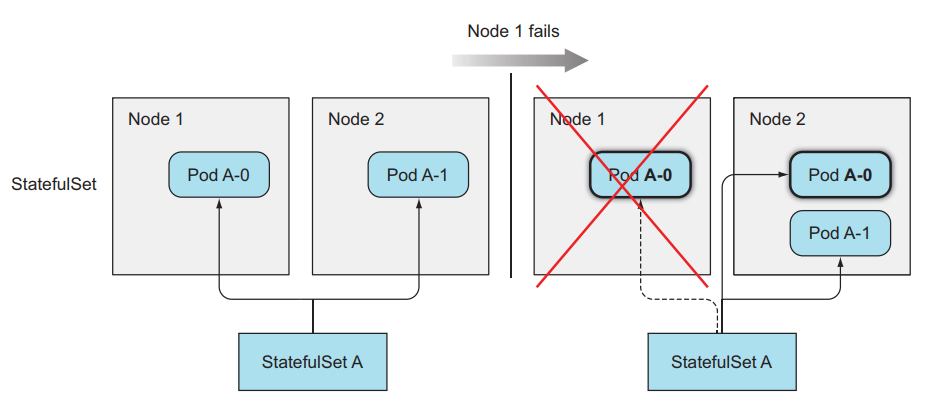
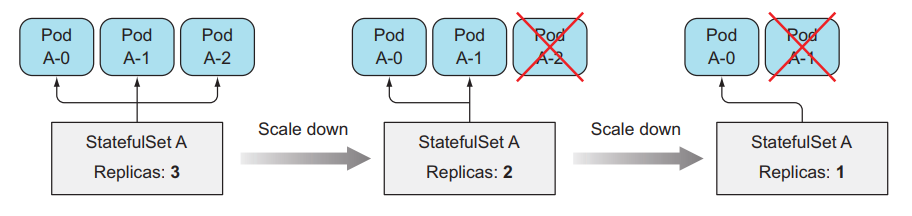
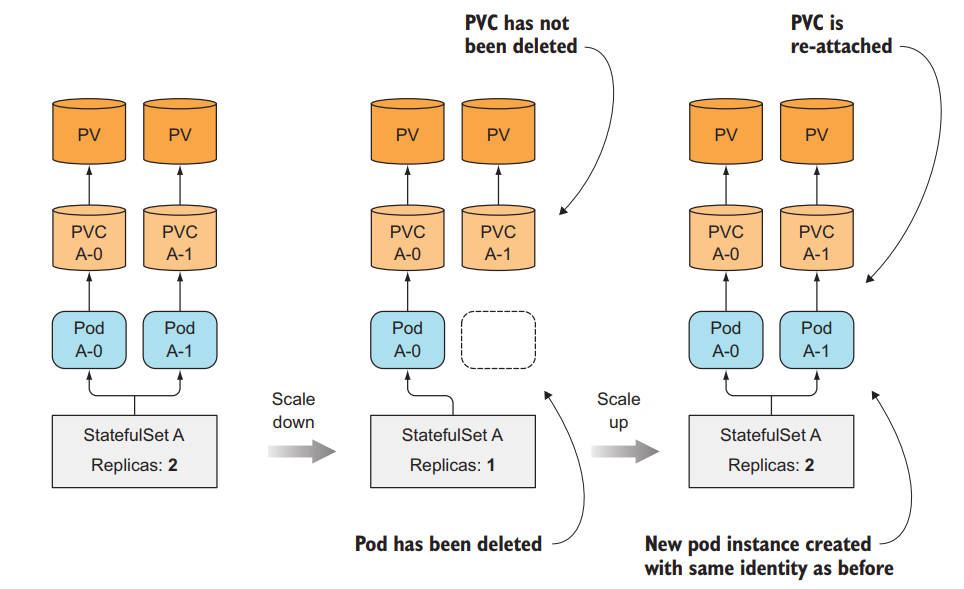

# StatefulSets: deploying replicated stateful applications
## Giới thiệu
Ở bài này chúng ta sẽ nói về StatefulSets, một resource sẽ giúp ta deploy một stateful application.

> **Stateless application** là một ứng dụng mà không có lưu trữ trạng thái của chính nó, hoặc là không có lưu trữ dữ liệu mà cần persistent storage. Ví dụ là một web server API mà không có lưu trữ hình ảnh, hoặc session login của user, thì đó là một stateless apps, bởi vì cho dù ta có xóa ứng dụng của ta và tạo lại nó bao nhiêu lần thì cũng không ảnh hưởng tới dữ liệu của người dùng. Bởi vì dữ liệu của ta được lưu trữ thông qua database, web server API chỉ kết nối với database và lưu trữ dữ liệu, chứ nó không có dữ liệu của chính nó. Một ví dụ nữa là command line app, nó không cần phải lưu trữ dữ liệu gì cả, tất cả những gì nó cần là xuất ra kết quả và không cần phải lưu lại kết quả đó. Những đặc tính của stateless app sẽ giúp nó dễ dàng scale hơn.

> **Stateful application** thì yêu cầu có trạng thái (state) của chính nó, và cần lưu lại state đó, hoặc yêu cầu phải có lưu trữ dữ liệu mà cần persistent storage, dữ liệu này sẽ được sử dụng bởi client và các app khác. Ví dụ như là database, nó sẽ có dữ liệu riêng của nó.

Ở trong kubernetes ta có thể deploy một stateful application bằng cách tạo Pod và config volume cho Pod, hoặc dùng `PersistentVolumeClaim`. Nhưng ta chỉ có thể tạo một single instance của Pod mà kết nối tới `PersistentVolumeClaim` đó. Vậy thì có thể dùng `ReplicaSet` để tạo replicated stateful app không? Cái ta muốn là sẽ tạo ra nhiều replicas của Pod, và mỗi Pod ta sẽ dùng một `PersistentVolumeClaim` riêng, để chạy được một ứng dụng distributed data store.

## 2. Hạn chế của việc sử dụng ReplicaSet để tạo replicated stateful app

Vì ReplicaSet tạo nhiều pod replicas từ một Pod template, nên những Pod được replicated đó không khác với những Pod khác ngoại trừ tên và IP. Nếu ta config volume trong Pod template thì tất cả các Pod được replicated đều lưu trữ dữ liệu chung một storage.


Nên ta không thể sử dụng một ReplicaSet rồi set thuộc tính replicas của nó để chạy một ứng dụng distributed data store được. Ta cần phải sử dụng cách khác.

### 2.1 Tạo nhiều ReplicaSet chỉ có một Pod mỗi ReplicaSet

Ta tạo nhiều ReplicaSet và mỗi ReplicaSet đó sẽ có một template Pod khác nhau.


Ta có thể dụng cách này để deploy một ứng dụng **distributed data store**. Nhưng đây không phải là cách tốt, ví dụ khí ta muốn scale ứng dụng của ta lên thì ta sẽ làm thế nào? Ta chỉ có cách là tạo thêm một ReplicaSet bằng tay, công việc này không tự động chút nào. Ta chọn kubernetes để chạy ứng dụng là vì muốn mọi thứ như scale đều được tự động và dễ dàng nhất.

### 2.2 Cung cấp stable identity cho mỗi Pod

Đối với statefull application, ta cần định danh cho mỗi Pod, vì Pod có thể bị xóa và tạo lại bất cứ lúc nào, khi ReplicaSet thay thế một thằng Pod cũ bằng Pod mới thì Pod mới tạo ra sẽ có tên khác và IP khác. Cho dù dữ liệu ta vẫn còn đó và giống như Pod cũ, nhưng đối với một số ứng dụng, khi ta tạo Pod mới mà nó có một network identity mới (như địa chỉ IP) thì sẽ sinh ra nhiều vấn đề. Nên ta cần phải dùng Service để identity IP cho Pod, ta có bao nhiêu ReplicaSet thì ta sẽ cần tạo bấy nhiêu Service tương ứng.


Khi ta có thêm Service, lúc này ta muốn scale lên, bên cạnh việc phải tạo một ReplicaSet mới, bây giờ ta cần phải tạo thêm một Service mới cho thằng ReplicaSet tương ứng nữa, gấp đôi công việc phải làm bằng tay.

Thì để giải quyết những vấn đề trên, có thể dễ dạng tạo nhiều replicated của Pod, mỗi thằng sẽ có một định danh riêng, và dễ dạng tự động scale mà không cần ta phải làm bằng tay quá nhiều, giúp ta dễ hơn trong việc tạo một ứng dụng distributed data store. Kubernetes cung cấp cho chúng ta một resource tên là **StatefulSet**.

## 3. StatefulSets

Giống như ReplicaSet, StatefulSet là một resource giúp chúng ta chạy nhiều Pod mà cùng một template bằng cách set thuộc tính replicas, nhưng khác với ReplicaSet ở chỗ là Pod của StatefulSet sẽ được định danh chính xác và mỗi thằng sẽ có một stable network identity của riêng nó.

Mỗi Pod được tạo ra bởi StatefulSet sẽ được gán với một index, index này sẽ được sử dụng để định danh cho mỗi Pod. Và tên của Pod sẽ được đặt theo kiểu `<statefulset name>-<index>`, chứ không phải random như của ReplicaSet.


### 3.1 Cách StatefulSets thay thế một Pod bị mất

Khi một Pod mà được quản lý bởi một **StatefulSets** bị mất (do bị ai đó xóa đi), thằng StatefulSets sẽ tạo ra một Pod mới để thay thế thằng cũ tương tự như cách làm của ReplicaSet, nhưng thằng Pod được tạo mới này sẽ có tên và hostname giống y như thằng cũ.



Còn thằng ReplicaSet thì sẽ tạo ra thằng Pod mới hoàn toàn khác với thằng cũ.


### 3.2 Cách StatefulSets scale Pod

Khi ta scale up Pod trong StatefulSets, nó sẽ tạo ra một Pod mới được đánh index là số tiếp theo của index hiện tại. Ví dụ StatefulSets đang có replicas bằng 2, sẽ có 2 Pod là `<pod-name>-0`,`<pod-name>-1`, khi ta scale up Pod lên bằng 3, Pod mới được tạo ra sẽ có tên là `<pod-name>-2`.

Tương tự như vậy với scale down, nó sẽ xóa Pod với index lớn nhất. Đối với StatefulSets thì khi ta scale up và scale down thì ta có thể biết chính xác tên của Pod sẽ được tạo ra hoặc xóa đi.



### 3.3 Cung cấp storage riêng biệt cho mỗi Pod

Tới đây thì chúng ta đã biết cách StatefulSets định danh cho mỗi thằng Pod, vậy còn storage thì sao? Mỗi Pod của chúng ta cần có một storage của riêng nó, và khi ta scale down số lượng Pod và scale up lại thì thằng Pod tạo ra mà có index giống với thằng cũ thì vẫn giữ nguyên storage của nó như không phải tạo ra một thằng storage khác.

Thằng StatefulSets làm được việc đó bằng cách tách storage ra khỏi Pod bằng cách sử dụng [PersistentVolumeClaims](../06.PersistentVolumeClaims/README.md). StatefulSets sẽ tạo ra PersistentVolumeClaims cho mỗi Pod và gắn nó vào cho từng Pod tương ứng.


Khi ta scale up Pod trong StatefulSets, thì sẽ có một Pod và một PersistentVolumeClaims mới được tạo ra, nhưng khi ta scale down, thì chỉ có thằng Pod bị xóa đi, thằng PersistentVolumeClaims vẫn giữ ở đó và không bị xóa. Để khi ta scale up lại thì thằng Pod vẫn được gắn đúng với PersistentVolumeClaims trước đó để dữ liệu của nó vẫn được giữ nguyên.



### 3.4 Tạo một StatefulSets

Giờ ta sẽ tạo thử một StatefulSets. Tạo một file tên là `kubia-statefulset.yaml` với image `luksa/kubia-pet`, code của image như sau:
```
const http = require('http');
const os = require('os');
const fs = require('fs');

const dataFile = "/var/data/kubia.txt";

function fileExists(file) {
  try {
    fs.statSync(file);
    return true;
  } catch (e) {
    return false;
  }
}

var handler = function(request, response) {
  if (request.method == 'POST') {
    var file = fs.createWriteStream(dataFile);
    file.on('open', function (fd) {
      request.pipe(file);
      console.log("New data has been received and stored.");
      response.writeHead(200);
      response.end("Data stored on pod " + os.hostname() + "\n");
    });
  } else {
    var data = fileExists(dataFile) ? fs.readFileSync(dataFile, 'utf8') : "No data posted yet";
    response.writeHead(200);
    response.write("You've hit " + os.hostname() + "\n");
    response.end("Data stored on this pod: " + data + "\n");
  }
};

var www = http.createServer(handler);
www.listen(8080);
```

Trong file config này ta sẽ có một **Headless Service** và một StatefulSet tên là `kubia`. Trong config của StatefulSet thì ta phải chỉ định service name dùng để định danh network cho Pod, Pod template, và PersistentVolumeClaims template. Cái khác với config của ReplicaSet là ta cần khai báo thêm template cho PersistentVolumeClaims, StatefulSet sẽ dùng nó để tạo ra PVCs riêng cho từng Pod.


Chúng ta cần tạo Persistent Volume trước rồi Tạo StatefulSet:
```
kubectl apply -f kubia/kubia-pv.yaml
kubectl create -f kubia/kubia-statefulset.yaml
```

Giờ ta list Pod xem thử:
```
kubectl get po
>> NAME      READY   STATUS    RESTARTS   AGE
>> kubia-0   1/1     Running   0          3m52s
>> kubia-1   1/1     Running   0          3m46s
```
Ta thấy Pod chúng ta được tạo ra sẽ có tên được gán theo index, giờ ta list PVCs xem thử:
```
kubectl get pvc
NAME           STATUS   VOLUME                                     CAPACITY   ...
data-kubia-0   Bound    pvc-74d9c4d4-472a-4ba8-b89f-8c94ce5300fa   1Mi        
data-kubia-1   Bound    pvc-c7cd0e77-2889-4296-a20c-3e99dfb25a68   1Mi        
```
Tên của `PersistentVolumeClaims` sẽ được đặt theo tên mà ta chỉ định ở phần `volumeClaimTemplate` và nối với index. Ở đây thì ta đã thấy là mỗi Pod của chúng ta sẽ có định danh riêng và xài một PVCs riêng của nó. Đúng với thứ ta cần khi xây dựng một hệ thống lưu trữ phân tán.
### 3.5 Tương tác với Pod bằng định danh của nó

Giờ ta sẽ thử tương tác với từng thằng Pod riêng lẻ. Đâu tiên ta dùng câu lệnh proxy:
```
$ kubectl proxy
>> Starting to serve on 127.0.0.1:8001
```
Mở một terminal khác:
```
curl localhost:8001/api/v1/namespaces/default/pods/kubia-0/proxy/
>> You've hit kubia-0
>> Data stored on this pod: No data posted yet
curl -X POST -d "Hey there! This greeting was submitted to kubia-0." localhost:8001/api/v1/namespaces/default/pods/kubia-0/proxy/
>> Data stored on pod kubia-0
curl localhost:8001/api/v1/namespaces/default/pods/kubia-0/proxy/
>> You've hit kubia-0
>> Data stored on this pod: Hey there! This greeting was submitted to kubia-0.
```
Kết quả trả về in ra là ta đã kết nối với Pod kubia-0.


Bây giờ ta xóa Pod để kiểm tra xem Pod mới được tạo ra có sử dụng đúng PVCs cũ hay không.
```
kubectl delete po kubia-0
>> pod "kubia-0" deleted
kubectl get po
>> NAME      READY   STATUS    RESTARTS   AGE
>> kubia-0   1/1     Running   0          35s
>> kubia-1   1/1     Running   0          39m
```


Ta thấy rằng ở đây Pod mới của chúng ta tạo ra sẽ có định danh y như Pod cũ, đó là điều mà ta muốn, giờ ta thử xem dữ liệu trước đó của ta có còn ý nguyên trong Pod kubia-0 không.
```
kubectl proxy
curl localhost:8001/api/v1/namespaces/default/pods/kubia-0/proxy/
>> You've hit kubia-0
>> Data stored on this pod: Hey there! This greeting was submitted to kubia-0.
```
Dữ liệu của ta vẫn còn đây, đúng với thứ mà ta muốn. Như các bạn thấy thì dùng StatefulSet sẽ tạo ra cho các Pod được định danh và có PVCs cũng được định danh. Vậy còn network thì thế nào? Nghĩa là ta sẽ truy cập từng Pod cụ thể ra sao nếu không dùng proxy, ở các bài trước thì ta dùng Service để tương tác với Pod, mà thằng Service thì request của nó sẽ được gửi random tới những Pod phía sau chứ không phải chính xác một thằng Pod, ta muốn ta có thể request tới chính xác một thằng Pod.

Ở đây ta sẽ dùng một kĩ thuật gọi là **Headless Service**, như các bạn thấy trong file config ở trên ta có tạo một service mà chỉ định thuộc tính **clusterIP của nó là None**. Đây là cách ta sẽ tạo ra một Headless Service và định danh địa chỉ cho từng thằng Pod.

### 3.6 Headless Service

Đối với thằng Service ClusterIP bình thường, thì khi ta tạo Service đó, nó sẽ tạo ra một thằng Virtual IP cho chính nó và một thằng DNS tương ứng cho VIP đó, và thằng VIP này sẽ mapping với những thằng Pod phía sau Service.


Còn đối với thằng Headless Service, khi khai báo config ta sẽ chỉ định thuộc tính `clusterIP: None` cho nó, khi ta tạo một thằng Headless Service thì nó sẽ không tạo ra một Virtual IP cho chính nó, mà chỉ tạo ra một DNS. Sau đó, nó sẽ tạo ra DNS cho chính xác từng thằng Pod phía sau, và mapping DNS tới những thằng DNS của Pod phía sau nó. Ví dụ thằng kubia-0 thì sẽ có DNS tương ứng là **kubia-0.kubia.default.svc.cluster.local.**


Và ta có thể truy cập thẳng tới Pod bên trong cluster bằng cách gọi tới DNS `kubia-0.kubia` và `kubia-1.kubia` nếu truy cập cùng namespace. Hoặc dùng DNS `kubia-0.kubia.default.svc.cluster.local` và `kubia-1.kubia.default.svc.cluster.local` nếu truy cập khác namespace.

Headless Service cho phép chúng ta có thể truy cập thẳng tới một Pod nhất định sử dụng DNS, thay vì truy cập qua DNS của Service rồi request của ta sẽ được dẫn tới một Pod random. Ta kết hợp Headless Service với StatefulSet để cung cấp cho Pod một stable network identity, và vì mỗi Pod có định danh bằng index riêng nên ta có thể biết chính xác Pod nào chúng ta cần gọi tới.

## 4. Cách StatefulSet làm việc với node failures
Không giống như ReplicaSet, thằng StatefulSet sẽ đảm bảo việc không bao giờ tạo Pod mà có định danh giống nhau, nên khi một node failed. StatefulSet sẽ không tạo ra Pod mới trước khi chắc chắn rằng thằng cũ không còn nữa.

### 4.1 Cách Pod bị gỡ đi khi node fail
Khi một node failed, thì các Pod trên node đó sẽ có status là Unknown. Nếu sau một thời gian mà node không có sống lại, thì Pod trên node đó sẽ được tháo ra, status của nó sẽ được update thành Terminating.

Đối với ReplicaSet, vì các Pod của nó quản lý không có định danh nên tên của Pod sẽ không trùng nhau, nên khi một Pod của nó mà có status là Terminating, nó sẽ tạo ra một thằng mới, và khi thằng mới được tạo xong, bất kệ thằng cũ có bị Terminating hay chưa thì nó cũng bị xóa đi khỏi cluster.

Còn đối với StatefulSet, do Pod có định danh, nên khi Pod mới tạo ra sẽ có tên giống Pod cũ, nên khi một Pod nằm trên node failed và có status là Terminating, StatefulSet vẫn sẽ không tạo ra Pod mới cho tới khi chắc chắn ràng Pod đã bị xóa hoàn toàn. Nhưng vì node của ta đã die đi rồi, nên nó không thể báo lại cho kubernetes master là thằng Pod đó đã bị xóa đi thành công hay chưa được, nên Pod sẽ cứ ở trạng thái Terminating hoài, lúc này ta cần phải xóa Pod đi bằng tay.
## 5. Kết luận

Vậy là ta đã tìm hiểu xong về  **StatefulSet**, dùng StatefulSet cho stateful application và database, nên dùng StatefulSet để chạy database thay vì dùng ReplicaSet hoặc Deployment