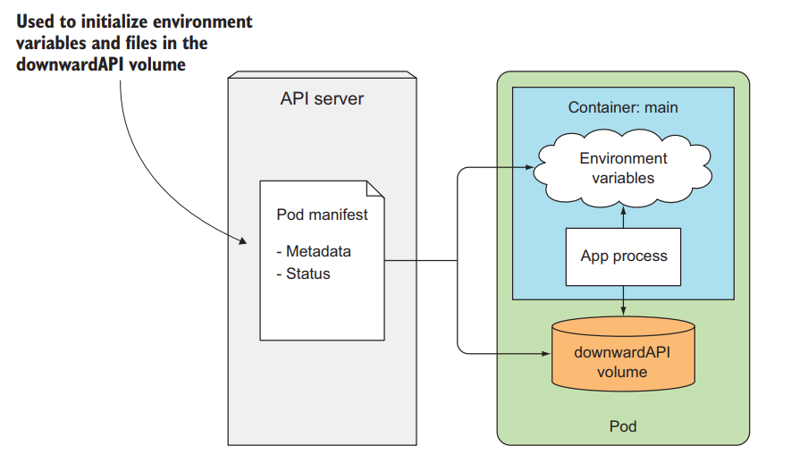
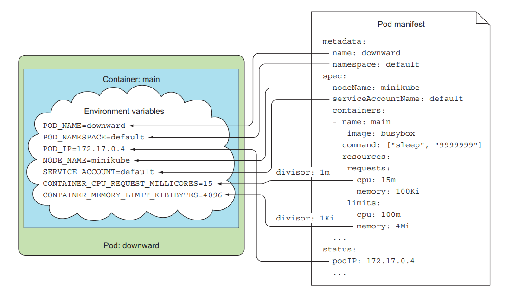
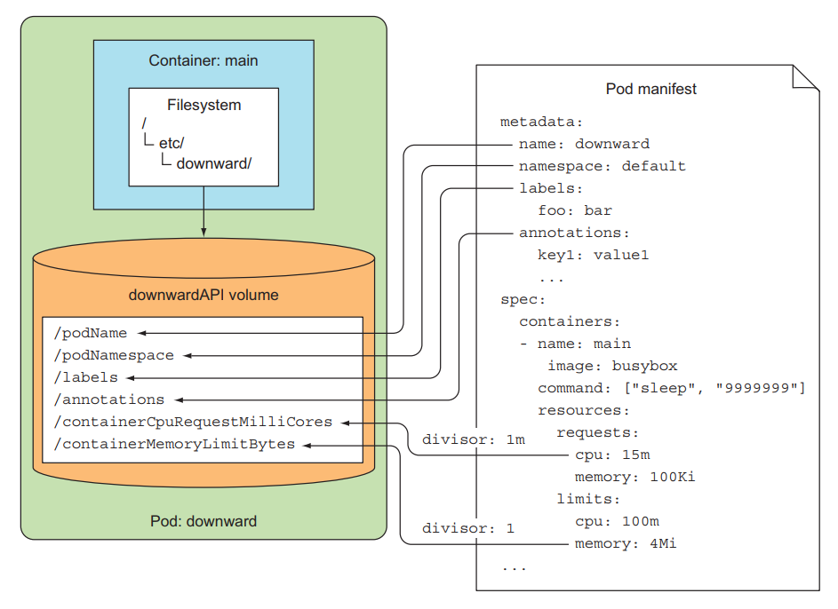
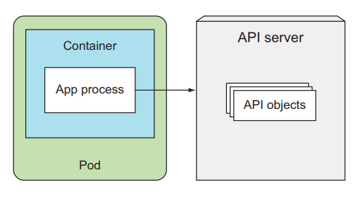
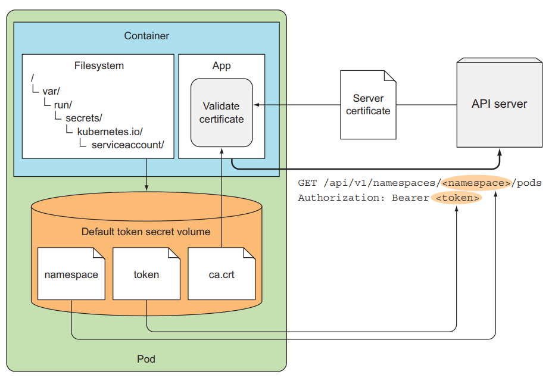
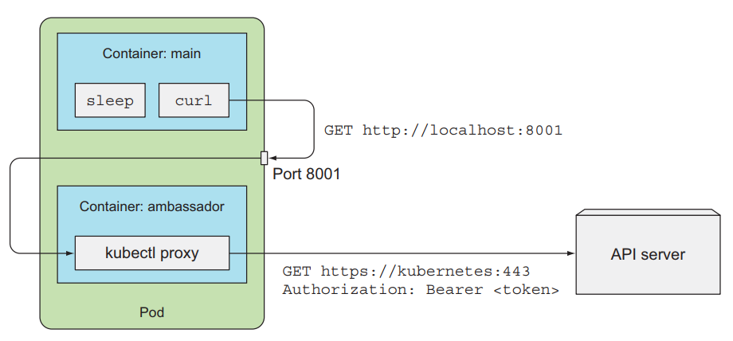

# Downward API: truy cập Pod metadata
## 1. Giới thiệu
Từ bài này trở đi chúng ta sẽ đi sâu hơn vào cấu trúc và cách vận hành của kubernetes, bài đầu tiên ta sẽ nói về cách để một container có thể truy cập được metadata của Pod mà nó thuộc về dùng **Downward API**, và cách để container có thể truy cập được thông tin của những Pod khác bên trong kubernetes cluster dùng Kubernetes REST API.

Một ứng dụng thường sẽ cần thông tin về môi trường nó đang chạy, bao gồm cả thông tin chi tiết về chính bản thân nó và cả thông tin về các ứng dụng khác đang chạy cùng môi trường với nó. Ví dụ như là một web server cần phải biết thông tin về địa chỉ của database, địa chỉ của redis. Một ứng dụng network cần phải biết tên của worker node nó được deploy tới. Một ứng dụng monitor cần phải biết thông tin của các ứng dụng nó cần monitor.

Đối với thông tin về địa chỉ database và redis thì ta có thể biết trước và truyền qua cấu hình env của Pod. Nhưng đối với thông tin về tên của worker node mà Pod nó sẽ được deploy tới thì ta không thể biết trước được, ví dụ như ta có 10 worker node, thì ta không biết được Pod đó sẽ được deploy tới thằng node nào để ta chỉ định env trước được. Ta chỉ biết khi Pod nó đã được deploy tới thằng node đó mà thôi, nếu vậy thì làm sao ta truyền tên của node đó vào ứng dụng được?

Một ví dụ khác nữa là ta có một ứng dụng cần phải biết tên của Pod của nó thuộc về, nhưng nếu ta deploy Pod bằng ReplicaSet thì tên của Pod sẽ là random, ta không thể biết được tên của Pod trừ khi nó đã được tạo, vậy thì làm sao ta truyền giá trị đó vào ứng dụng thông qua cấu hình env của Pod được? Thì kubernetes có cung cấp cho ta một thằng gọi là Kubernetes Downward API để hỗ trợ những trường hợp như trên.

## 2. Downward API

Downward API cho phép ta truyền metadata của Pod và các thông tin môi trường của nó vào bên trong container. Ta có thể sử dụng những thông tin này và truyền nó qua config env của Pod, hoặc config volume của Pod để truyền vào container như một file. Và đừng để tên của Downward API làm bạn nhầm lẫn, nó không phải là một REST endpoint, nó chỉ là cách để ta truyền thông tin meta của Pod vào trong container.


### 2.1 Metadata của Pod mà Downward API hỗ trợ

Downward API cho phép ta truyền vào container những thông tin như sau:

- Tên của Pod
- IP của Pod
- Namespace của Pod
- Tên của node mà Pod đang chạy
- Tên của ServiceAccount (sẽ nói ở các bài sau) của Pod
- CPU và memory yêu cầu của mỗi container
- CPU và memory giới hạn của mỗi container
- Labels của Pod
- Annotations của Pod

Tất cả thuộc tính trên đều có thể truyền vào Pod thông qua env, chỉ trừ labels và annotations thì phải truyền theo dạng volume file.

### 2.2 Truyền metadata bằng env

Giờ ta sẽ tạo một Pod và truyền metadata của Pod vào container. Tạo một file tên là `downward-api-env.yaml` với config như sau:
```
apiVersion: v1
kind: Pod
metadata:
  name: downward
spec:
  containers:
    - name: main
      image: busybox
      command: ["sleep", "9999999"]
      resources:
        requests:
          cpu: 15m
          memory: 100Ki
        limits:
          cpu: 100m
          memory: 8Mi
      env:
        - name: POD_NAME
          valueFrom:
            fieldRef: # using downward API
              fieldPath: metadata.name # the metadata.name field from the pod manifest
        - name: POD_NAMESPACE
          valueFrom:
            fieldRef:
              fieldPath: metadata.namespace # the metadata.namespace field from the pod manifest
        - name: POD_IP
          valueFrom:
            fieldRef:
              fieldPath: status.podIP # access pod IP
        - name: NODE_NAME
          valueFrom:
            fieldRef:
              fieldPath: spec.nodeName # access node name
        - name: CONTAINER_CPU_REQUEST_MILLICORES
          valueFrom:
            resourceFieldRef: # using resourceFieldRef instead of fieldRef.
              resource: requests.cpu
              divisor: 1m
        - name: CONTAINER_MEMORY_LIMIT_KIBIBYTES
          valueFrom:
            resourceFieldRef:
              resource: limits.memory
              divisor: 1Ki

```
Ta sẽ dùng thuộc tính `fieldRef` và `resourceFieldRef` trong config env của Pod để thông qua Downward API truyền metadata vào container. Với fieldRef ta sẽ chỉ định thuộc tính fieldPath cho nó, và truy cập tên của Pod dùng `metadata.name`, tên của worker node dùng `spec.nodeName`.

Đối với env mà truy cập resource requests và limit của container, ta chỉ định thêm trường divisor, giá trị của requests và limit sẽ chia cho số này để ra giá trị ta truyền vào container. Ví dụ, ở config trên ta chỉ định `requests.cpu: 15m`, `divisor: 1m` => thì giá trị env `CONTAINER_CPU_REQUEST_MILLICORES` sẽ là 15m/1m = 15. `limits.memory` là 8Mi, divisor 1Ki => thì giá trị `CONTAINER_MEMORY_LIMIT_KIBIBYTES` env sẽ là 8Mi/1Ki = 8192.



Tạo Pod và kiếm tra thử:
```
kubectl apply -f downward-api-env.yaml
kubectl exec downward main -- env
>>
    PATH=/usr/local/sbin:/usr/local/bin:/usr/sbin:/usr/bin:/sbin:/bin
    HOSTNAME=downward
    POD_NAME=downward
    POD_NAMESPACE=default
    POD_IP=10.1.11.166
    NODE_NAME=docker-desktop
    CONTAINER_CPU_REQUEST_MILLICORES=15
    CONTAINER_MEMORY_LIMIT_KIBIBYTES=8192
    KUBERNETES_SERVICE_PORT_HTTPS=443
    KUBERNETES_PORT=tcp://10.96.0.1:443
    KUBERNETES_PORT_443_TCP=tcp://10.96.0.1:443
    KUBERNETES_PORT_443_TCP_PROTO=tcp
    KUBERNETES_PORT_443_TCP_PORT=443
    KUBERNETES_PORT_443_TCP_ADDR=10.96.0.1
    KUBERNETES_SERVICE_HOST=10.96.0.1
    KUBERNETES_SERVICE_PORT=443
    HOME=/root
```

Các bạn sẽ thấy được những thông tin metadata của Pod đã nằm trong env của container. Và ứng dụng của ta có thể sử dụng những env mình cần.

### 2.3 Truyền metadata bằng volume file

Giờ thi ta sẽ truyền metadata thông qua config volume và mount vào container như 1 file. Tạo một file tên là `downward-api-volume.yaml` với config như sau:
```
apiVersion: v1
kind: Pod
metadata:
  name: downward-volume
spec:
  containers:
    - name: main
      image: busybox
      command: ["sleep", "9999999"]
      resources:
        requests:
          cpu: 15m
          memory: 100Ki
        limits:
          cpu: 100m
          memory: 8Mi
      volumeMounts:
        - name: downward
          mountPath: /etc/downward
  volumes:
    - name: downward
      downwardAPI: # using downward API
        items:
          - path: "podName" # file name mount to container
            fieldRef:
              fieldPath: metadata.name
          - path: "podNamespace"
            fieldRef:
              fieldPath: metadata.namespace
          - path: "labels"
            fieldRef:
              fieldPath: metadata.labels
          - path: "annotations"
            fieldRef:
              fieldPath: metadata.annotations
          - path: "containerCpuRequestMilliCores"
            resourceFieldRef:
              containerName: main
              resource: requests.cpu
              divisor: 1m
          - path: "containerMemoryLimitBytes"
            resourceFieldRef:
              containerName: main
              resource: limits.memory
              divisor: 1Ki
```

Ở đây thì ta sẽ chỉ định volume và dùng thuộc tính downwardAPI để truyền metadata vào container ở dạng file nằm ở folder `/etc/downward`. Khi sử dụng ở dạng volume thì khi khai báo config của `resourceFieldRef`, ta cần thêm thuộc tính `containerName` để chọn container mà muốn lấy request và limit.


Tạo Pod và kiểm tra:
```
kubectl apply -f downward-api-volume.yaml
kubectl exec downward-volume -- ls -lL /etc/downward
>>
    -rw-r--r-- 1 root root 134 May 25 10:23 annotations
    -rw-r--r-- 1 root root 2 May 25 10:23 containerCpuRequestMilliCores
    -rw-r--r-- 1 root root 7 May 25 10:23 containerMemoryLimitBytes
    -rw-r--r-- 1 root root 9 May 25 10:23 labels
    -rw-r--r-- 1 root root 8 May 25 10:23 podName
    -rw-r--r-- 1 root root 7 May 25 10:23 podNamespace

kubectl exec downward -- cat /etc/downward/labels
>> foo="bar
```
Như các bạn có thể thấy là sử dụng Downward API không khó lắm. Nó cho phép ta truyền những thông tin cơ bản của môi trường và những thông tin cần thiết của Pod vào container. Nhưng những dữ liệu nó hỗ trợ thì khá giới hạn, ta không thể truy cập thông tin về những Pod khác bằng cách sử dụng Downward API được. Nếu ta cần truy cập nhiều thông tin hơn, thì ta sẽ dử dụng Kubernetes API server, một REST API chính hiệu.

## 3. Kubernetes API server

Đây là một REST API, cho phép chúng ta gọi tới nó và lấy những thông tin cần thiết về cluster của chúng ta, nhưng cách xài thì không dễ như thằng Downward API.


Để gọi tới thằng API server thì ta phải cần authentication thì mới gọi được tới API server. Trước khi nói về cách tương tác với API server thì ta sẽ nhìn xem nó như thế nào trước.

### 3.1 Khám phá API server
Để check URL của API server, ta chạy câu lệnh:
```
kubectl cluster-info
>>
    Kubernetes control plane is running at https://192.168.49.2:8443
    CoreDNS is running at https://192.168.49.2:8443/api/v1/namespaces/kube-system/services/kube-dns:dns/proxy

    To further debug and diagnose cluster problems, use 'kubectl cluster-info dump'.
```
Tùy vào môi trường của bạn, URL này sẽ in ra là một IP hay một DNS, với port là 8443. Ta gửi request tới API server.
```
curl https://192.168.49.2:8443
>>
    3curl: (60) SSL certificate problem: unable to get local issuer certificate
    More details here: https://curl.haxx.se/docs/sslcerts.html

    curl failed to verify the legitimacy of the server and therefore could not
    establish a secure connection to it. To learn more about this situation and
    how to fix it, please visit the web page mentioned above.
```
Bạn sẽ thấy nó in lỗi, vì URL này chạy HTTPS, để gọi tới nó thì ta truyền thêm params `--insecure` (hoặc `-k`).

```
$ curl -k https://192.168.49.2:8443
>>
    {
    "kind": "Status",
    "apiVersion": "v1",
    "metadata": {
        
    },
    "status": "Failure",
    "message": "forbidden: User \"system:anonymous\" cannot get path \"/\"",
    "reason": "Forbidden",
    "details": {
        
    },
    "code": 403
    }
```
Lúc này thì ta đã gọi tới được kubernetes API server, nhưng nó sẽ trả về lỗi 403 vì ta cần phải **authentication** mới gọi tới nó được. Thì có nhiều cách để authentication tới server, nhưng bây giờ để test thì ta có thể dùng `kubectl proxy` để expose API server mà không cần phải authentication tới nó.
```
kubectl proxy
>> Starting to serve on 127.0.0.1:800
```
Mở một terrminal khác.
```
curl 127.0.0.1:8001
>>
    {
    "paths": [
        "/.well-known/openid-configuration",
        "/api",
        "/api/v1",
        "/apis",
        "/apis/"
        ...
        ]
    }
```
Yep. Chúng ta đã gọi tới được API server, bạn sẽ thấy kết quả nó trả về là những endpoint API server mà bạn có thể gọi tới.

### 3.2 Tương tác với API server

Trong mảng paths, bạn sẽ thấy có một dường dẫn là `/api/v1`, đây là đường dẫn chứa những resource cơ bản của chúng ta. Các bạn còn nhớ khi khai báo một file config, ta thường chỉ định thuộc tính apiVersion đầu tiên chứ? Thuộc tính đó sẽ liên quan tới những đường dẫn này.

Ví dụ, khi khai báo Pod, ta cần chỉ định apiVersion: v1, điều đó tương ứng với Pod resource sẽ nằm trong API `/api/v1`. Ta gọi tới dường dẫn này thử:
```
curl 127.0.0.1:8001/api/v1
>>
    {
    "kind": "APIResourceList",
    "groupVersion": "v1",
    "resources": [
        ...
        {
        "name": "configmaps",
        "singularName": "",
        "namespaced": true,
        "kind": "ConfigMap",
        "verbs": [
            "create",
            "delete",
            "deletecollection",
            "get",
            "list",
            "patch",
            "update",
            "watch"
        ],
        "shortNames": [
            "cm"
        ],
        "storageVersionHash": "qFsyl6wFWjQ="
        },
        ...
        {
        "name": "pods",
        "singularName": "",
        "namespaced": true,
        "kind": "Pod",
        "verbs": [
            "create",
            "delete",
            "deletecollection",
            "get",
            "list",
            "patch",
            "update",
            "watch"
        ],
        "shortNames": [
            "po"
        ],
        "categories": [
            "all"
        ],
        "storageVersionHash": "xPOwRZ+Yhw8="
        }
        ...
    ]
    }
```

Ta sẽ thấy nó list ra hết tất cả các resource mà nằm trong nó, trong đó có Pod và Configmap.

Ta có thể list hết các Pod trong một namespace bằng cách gọi tới đường dẫn API như sau:
```
curl 127.0.0.1:8001/api/v1/namespaces/default/pods
>>
    {
    "kind": "PodList",
    "apiVersion": "v1",
    "metadata": {
        "resourceVersion": "1152707"
    },
    "items": [
    ...
    ]
    }
```
Để lấy thông tin của 1 Pod.
Với cấu trúc `<api-server-url>/api/v1/namespaces/<namespace-name>/pods/<pod-name>`. Tới đây thì ta đã biết cách tương tác với API server dùng kubectl proxy, còn ở bên trong một container, ta sẽ tương tác với nó như thế?

### 3.3 Tương tác API server bên trong container của Pod

Để tương tác với API server bên trong Pod thì ta cần biết URL của nó, thằng kubernetes có cung cấp cho ta một ClusterIP mặc định cho API server.
```
kubectl get svc
>> NAME         TYPE        CLUSTER-IP   EXTERNAL-IP   PORT(S)   AGE
>> kubernetes   ClusterIP   10.96.0.1    <none>        443/TCP   103d
```
Ta có một service tên là kubernetes, vậy ở bên trong container, ta có thể gọi tới API server bằng URL `https://kubernetes`. Ta tạo một pod và truy cập vào nó để test thử:
```
kubectl run curl --image=curlimages/curl --command -- sleep 9999999

kubectl exec -it curl -- sh
/ $ curl https://kubernetes
>>
    curl: (60) SSL certificate problem: unable to get local issuer certificate
    More details here: https://curl.se/docs/sslcerts.html

    curl failed to verify the legitimacy of the server and therefore could not
    establish a secure connection to it. To learn more about this situation and
    how to fix it, please visit the web page mentioned above.
```
Ta đã truy cập được vào trong Pod, bây giờ thì ta sẽ gửi request tới API server, ở trên thì khi ta gọi ta truyền vào options -k, thì trong thực tế ta không nên làm vậy, mà ta sẽ sử dụng file server certificate để verification với HTTPS server, thì file CA và thông tin để authentication tới API server sẽ nằm ở folder `/var/run/secrets/kubernetes.io/serviceaccount/` bên trong một container, sẽ có 3 file mà được tự động mount vào bên trong một container khi container được tạo ra, thông tin của 3 file này nằm trong một resource tên là `ServiceAccount`, ta sẽ nói về resource này sau, bây giờ ta chỉ cần hiểu là ta sẽ sử dụng nó để authentication tới API server.

Nhảy tới folder `/var/run/secrets/kubernetes.io/serviceaccount/`.
```
/ $ cd /var/run/secrets/kubernetes.io/serviceaccount/
/run/secrets/kubernetes.io/serviceaccount $ ls
>> ca.crt     namespace  token
```
Khi ta list ra, ta sẽ thấy có file `ca.crt`, đây là server certificate để ta verification với HTTPS của API server. Ta sẽ sử dụng nó như sau:
```
run/secrets/kubernetes.io/serviceaccount $ curl --cacert ca.crt  https://kubernetes ; echo
>>
    {
    "kind": "Status",
    "apiVersion": "v1",
    "metadata": {},
    "status": "Failure",
    "message": "forbidden: User \"system:anonymous\" cannot get path \"/\"",
    "reason": "Forbidden",
    "details": {},
    "code": 403
    }
```

OK. Ta đã gọi tới được API server. Giờ ta sẽ authentication với API server. Các bạn sẽ thấy có một file tên là token, ta dùng file này để authentication với API server.
```
/run/secrets/kubernetes.io/serviceaccount $ TOKEN=$(cat token)
/run/secrets/kubernetes.io/serviceaccount $ curl --cacert ca.crt -H "Authorization: Bearer $TOKEN" https://kubernetes
>>
    {
    "paths": [
        "/.well-known/openid-configuration",
        "/api",
        "/api/v1",
        "/apis",
        "/apis/",
        ...
    ]
    }
```

Yep, vậy là ta đã tương tác với API server và gọi được tới nó mà không bị 403. Trong một container thì ta sẽ sử dụng 3 file tự động được mount vào bên trong container của Pod thông qua ServiceAccount để authentication tới API server. Đây là hình minh họa.



> NOTE: Có một số cluster bạn sẽ cần kích hoạt RBAC (sẽ nói ở bài về ServiceAccount) mới có thể authentication tới API server được.

## 4. AMBASSADOR containers pattern trong Kubernetes

Thay vì ta phải làm nhiều thứ như dùng `ca.crt` và dùng token file, ta có thể dùng một pattern tên là `ambassador`. Pattern này sẽ deploy thêm một container cùng Pod với container chính, container phụ này sẽ được gọi là Sidecar Container, có tác dụng support chức năng cho container chính. Ở đây thì sidecar container này sẽ phụ trách việc authentication tới API server. Container chính chỉ cần gọi tới sidecar container và nó sẽ gửi request của main container tới API server.

\

## 5. Sử dụng SDK để tương tác với API server

Nếu ta chỉ thực hiện các tác vụ đơn giản với API server như list resource, thì ta có thể gọi qua REST API cho đơn giản. Nhưng nếu ta muốn tương tác nhiều hơn với API server, thì ta nên dùng client library. Kubernetes có một số SDK tương tứng với các ngôn ngữ mà ta có thể xài nó để làm việc với API server:

- Golang client: https://github.com/kubernetes/client-go.
- Python: https://github.com/kubernetes-incubator/client-python.
- Nodejs: https://github.com/kubernetes-client/javascript.
- Và còn nhiều SDK khác, các bạn có thể xem ở [đây](https://kubernetes.io/docs/reference/using-api/client-libraries/).

Ví dụ đoạn code tạo namespace dùng nodejs sdk:
```
const k8s = require('@kubernetes/client-node');

const kc = new k8s.KubeConfig();
kc.loadFromDefault();

const k8sApi = kc.makeApiClient(k8s.CoreV1Api);

var namespace = {
    metadata: {
        name: 'test',
    },
};

k8sApi.createNamespace(namespace).then(
    (response) => {
        console.log('Created namespace');
        console.log(response);
        k8sApi.readNamespace(namespace.metadata.name).then((response) => {
            console.log(response);
            k8sApi.deleteNamespace(namespace.metadata.name, {} /* delete options */);
        });
    },
    (err) => {
        console.log('Error!: ' + err);
    },
);

```

Như các bạn thấy thì dùng Kubernetes API server, ta có thể lấy được thông tin của các ứng dụng khác bên trong cluster, và các thông tin của cluster nếu ta cần.

## 6. Kết luận
Vậy là ta đã tìm hiểu xong về Downward API và API server, sử dụng chúng khi ta muốn container có thể truy cập metadata của Pod và thông tin của cluster và các ứng dụng khác bên trong nó.