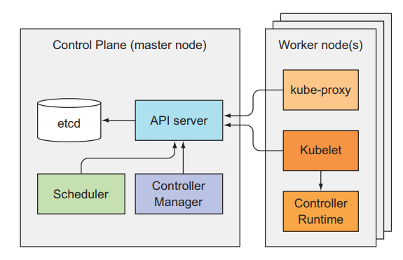
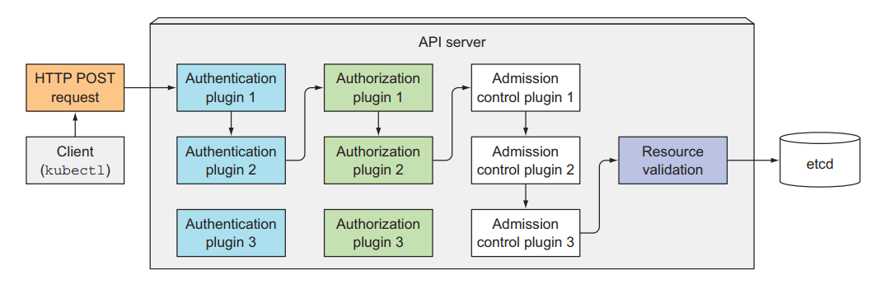
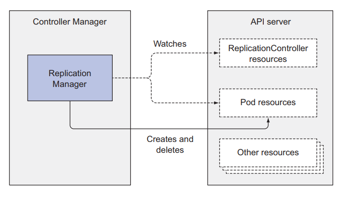
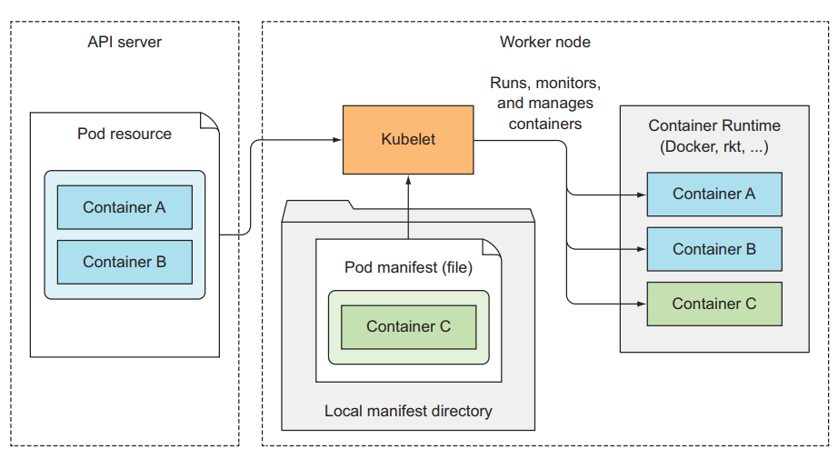
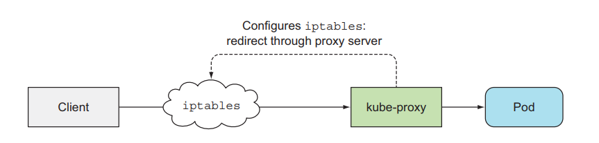
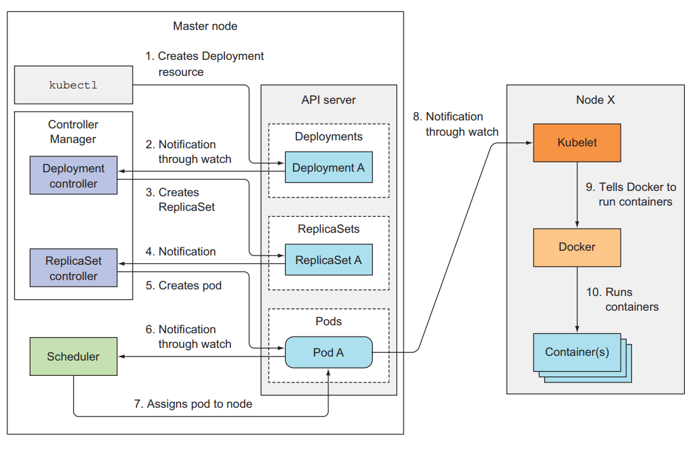

# Kubernetes internals architecture
## 1. Giới thiệu

Ở bài này trong ta sẽ nói về kiến trúc bên trong kubernetes, một kubernetes cluster sẽ bao gồm những thành phần nào? Và từng thành phần đó sẽ hoạt động như thế nào? Pod được deploy tới worker node như thế nào, làm sao để kubernetes biết worker node nào thích hợp nhất để deploy Pod lên đó? Từng resource như [Pod](../01.Pod/README.md), [ReplicaSet](../02.ReplicationSets/README.md), [Deployment](../04.Deployment/README.md) được tạo ra sao, thành phần nào đóng vai trò tạo nên những resource này? Những vấn để trên sẽ được nói hết trong bài viết này.

## 2. Tìm hiểu kiến trúc của kubernetes

Trước khi ta nói về cách làm sao kubernetes vận hành, ta sẽ nói qua về kiến trúc và các thành phần bên trong nó. Như mình ta nói ở bài đầu tiên, một kubernetes cluster sẽ gồm 2 phần chính là:

- Kubernetes master (control plane)
- Kubernetes worker node

Kubernetes master sẽ bao gồm 4 component:

- etcd
- API server
- Controller Manager
- Scheduler

Kubernetes worker node sẽ bao gồm 3 thành phần:

- kubelet
- kube-proxy
- container runtime

Bên cạnh những component chính, thì còn có một số add-on component phụ để enhance chức năng của kubernetes cluster như:

- Kubernetes DNS server
- Dashboard
- Ingress controller
- Container Network Interface network plugin



Tất cả những component đều độc lập và có chức năng riêng, một kubernetes cluster muốn chạy được thì cần tất cả component ở master và worker node đề phải hoạt động. Ta có thể kiểm tra trạng thái của các components ở Control Plane bằng cách dùng câu lệnh:
```
kubectl get componentstatuses
>>
    NAME                STATUS   MESSAGE             ERROR
    scheduler           Healthy  ok
    controller-manager  Healthy  ok
    etcd-0              Healthy  {"health": "true"}
```
### 2.1 Những component này giao tiếp với nhau như thế nào?

Tất cả những system component trên đều giao tiếp với nhau thông qua **API server**, chúng không giao tiếp trực tiếp với nhau. API server là thành phần duy nhất tương tác với etcd, không có component nào ngoài API server tương tác trực tiếp với etcd.

Ở worker node, container runtime sẽ được tạo và quản lý bởi kubelet. kubelet sẽ đóng vai trò giao tiếp giữa master và worker node thông qua API server.

### 2.2 Những component này chạy như thế nào trong cluster

Vậy những component này nó chạy ra sao trong cluster của chúng ta? Nó sẽ chạy như một ứng dụng cài trực tiếp trên server của chúng ta hay sao? Ví dụ như khi ta chạy nginx trên linux thì ta cần start systemd nginx.

Tất cả những component trong một kubernetes cluster sẽ không phải chạy như một ứng dụng cài trực tiếp trên server. Mà tất cả những component sẽ được chạy như một Pod, chúng sẽ được deploy tới master hoặc worker node và chạy như một Pod bình thường và nằm trong **namespace** tên là `kube-system`. Ta có thể list và xem những component đó:
```
kubectl get po -n kube-system
>>
    NAME                               READY   STATUS    RESTARTS         AGE
    coredns-787d4945fb-5d54v           1/1     Running   5 (27h ago)      9d
    etcd-minikube                      1/1     Running   5 (27h ago)      9d
    kube-apiserver-minikube            1/1     Running   5 (27h ago)      9d
    kube-controller-manager-minikube   1/1     Running   5 (27h ago)      9d
    kube-proxy-mwnqv                   1/1     Running   5 (27h ago)      9d
    kube-scheduler-minikube            1/1     Running   5 (27h ago)      9d
    storage-provisioner                1/1     Running   11 (5h24m ago)   9d
```

Các bạn có thể thấy là ở master node, ta có 4 component là `kube-controller-manager-minikube`, `etcd-minikube`, `kube-apiserver-minikube`, `kube-scheduler-minikube` component và 1 add-on `coredns`. Ở từng worker node, ta sẽ có `kube-proxy` component.

Các bạn sẽ để ý là ta sẽ không thấy một component đó là `kubelet`, thì thằng component này là thằng duy nhất chạy như một ứng dụng cài trực tiếp trên server chứ không phải một Pod trong kubernetes. Giờ thì ta sẽ đi sâu vào từng thằng component. Đầu tiên ta sẽ nói về **etcd**.

## 3. Etcd

Tất cả các resource ta đã tạo trong series này như Pod, ReplicaSet, Deployment, Service, ... Các bạn có tự hỏi là làm sao kubernetes biết là những resource nào đã được tạo ra, và khi ta list nó ra thì kubernetes lấy dữ liệu từ đâu để hiển thị nó ra không? Thì những thông tin đó được lấy ra từ etcd. Etcd là một database mà được dùng để lưu trữ những thông tin về các resource bên trong kubernetes. Etcd là database dạng key-value store và. Tất cả các component khác sẽ đọc và ghi dữ liệu vào etcd thông qua API server.

Ngoài ra etcd còn là một distributed storage. Có nghĩa là ta có thể có nhiều hơn 1 etcd database trong một cluster và tất cả dữ liệu lưu trữ trong từng database đó điều giống nhau. Để khi một database die thì ta vẫn có 1 database khác chạy, giúp cho cluster ta vẫn chạy bình thường được.

## 4. API server

Đây là component trung tâm mà được sử dụng bởi các component khác hoặc client. API server cung cấp cho ta một REST API để ta thực hiện các hành động CRUD (Create, Read, Update, Delete) lên cluster state (thông tin về toàn bộ resource trong cluster), đọc, ghi, thay đổi cluster state. Và lưu cluster state vào etcd.

API server sẽ chịu trách nhiệm Authentication, Authorization client, validation config của resource, chuyển đổi resource thành dạng có thể lưu vào trong etcd. Một API server client mà chúng ta hay xài nhất là `kubectl`.

Khi ta dùng kubectl để tạo một resouce, thằng kubectl này sẽ tạo một POST request kèm theo body là config của resource tới API server. Sau đó API server sẽ kiểm tra xem client này có được phép gọi tới nó hay không qua Authentication plugin, sau đó API sẽ kiểm tra quyền của client này có được thực hiện hành động này hay không qua Authorization plugin. Tiếp theo API server sẽ thực hiện chuyển đổi config resource ban đầu thành dạng format nó có thể đọc thông quá các Admission control plugin. Bước tiếp theo API server sẽ validation config của resource này có đúng hay không, nếu mọi thứ đều ok hết thì resource này sẽ được lưu vào `ectd`.



### 4.1 Authentication plugins

Đây là công việc đầu tiên của API server, nó sẽ thực hiện authentication với client thông qua một hay nhiều authentication plugins được config bên trong API server. API server sẽ thực hiện các plugin này theo từng cái, cho tới khi nó xác định cái request này là của ai. Token được sử dụng để thực hiện bước authentication này nằm ở trong header với key là Authorization, ta đã nói về nó ở bài [Downward API](../09.Downward-API/README.md). Các plugin này sẽ tách thông tin về username, user ID, and groups bên trong token, nếu mọi thứ ok, request này sẽ được chuyển qua bước tiếp theo là authorization, nếu không thì nó sẽ trả về lỗi 403.
### 4.2 Authorization plugins

Đây là công việc thứ hai của API server, sau khi xác định được client là ai, thì nó sẽ kiểm tra quyền của client này có được thực hiện một hành động lên trên một resouce hay không thông qua các authorization plugins, quyền này ta sẽ thiết lập ở RBAC (Role-based access control ta sẽ nói ở các bài sau). Ví dụ, khi ta đọc một Secret resource, các plugin này sẽ kiểm tra là ta có được quyền đọc Secret resource hay không, nếu không có quyền thì nó sẽ trả về lỗi 403. Nếu client có quyền thực hiện thì request này sẽ được chuyển qua bước chuyển đổi format.

### 4.3 Admission control plugin

Nếu một request mà thực hiện việc create, update hoặc delete resouce, thì nó sẽ được chuyển qua bước này (nếu request mà chỉ list thì source thì không). Ở bước này thì config resouce ban đầu, bất kể viết theo dạng YAML hay JSON, thì đều được chuyển sang dạng mà API server có thể validation và lưu vào etcd được, thông qua các admission control plugin. Ngoài ra các plugin này còn modify một số thông tin của resouce trước khi lưu vào etcd nếu ta có cài đặt trong API server.

Ví dụ, có một resouce mà sẽ config limit cpu và memory của toàn bộ Pod khi Pod được tạo ra, bất kể trong Pod của bạn có config limit này hay không. Đó là LimitRange resouce.
```
apiVersion: v1
kind: LimitRange
metadata:
  name: mem-limit-range
spec:
  limits:
  - default:
      memory: 512Mi
    type: Container
```
LimitRange resouce trên sẽ giới hạn limit memory của toàn bộ Pod trong default namespace là 512Mi. Khi ta tạo resouce này thì trong API server sẽ enable plugin là Admission Control LimitRange plugins. Tất cả config của pod sẽ được modify để thêm vào thuộc tính limit trước khi nó được tạo. Sau khi sau bước này thì request sẽ được chuyển qua bước cuối.

### 4.4 Validation resouce và lưu vào ectd

Đây là bước mà sẽ kiểm tra config resouce có đúng hay không, nếu có thì API server lưu reousce này vào etcd, tương đương với việc resouce đã được tạo ra.

API server sẽ chỉ làm những việc mà ta đã nói ở trên, lưu ý là nó sẽ không thực hiện công việc tạo ra Pod, hoặc tạo ra ReplicaSet, tất cả những gì nó làm là lưu resouce vào etcd, sau đó nó sẽ gửi thông báo tới component phụ trách việc tạo ra resouce đó là **Controller Manager**.

## 5. Controller Manager

Đây là component phụ trách việc tạo, deploy các resouce thông qua API server. Component này sẽ chứa nhiều controller khác nhau, mỗi controller sẽ thực hiện công việc riêng của nó. Một số controller như:

- Replication controllers
- Deployment controller
- StatefulSet controller
- ...

Từ tên của các controller thì ta cũng có thể đoán được là controller đó làm gì. Các controller này sẽ lắng nghe thông báo từ API server về các sự kiện mà thay đổi một resouce như là create, update hoặc delete và thực hiện hành động tương ứng với thay đổi đó. Là sẽ một ra một resouce object mới, hoặc update một cái có sẵn, hoặc xóa đi một thằng.

### 5.1 Replication controllers

Đây là controller làm những công việc liên quan tới [ReplicationControllers](../02.ReplicationSets/README.md) resouce. Nó sẽ lắng nghe thông báo từ API server về những thứ thay đổi liên quan tới ReplicationControllers resouce, và thực hiện việc theo dõi số lượng Pod hiện tại có bằng với thuộc tính replicas của nó hay không. Khi phát hiện số lượng Pod ít hơn so với thuộc tính replicas của nó, nó sẽ tạo một post request tới API server, để một Pod mới được tạo ra. 



### 5.2 Deployment controller

Đây là controller sẽ lắng nghe những thay đổi liên quan tới Deployment resouce, bên cạnh đó, nó sẽ cũng sẽ thực hiện các công việc như rollout update, và quản lý các **ReplicaSet** bên dưới nó.
### 5.3 StatefulSet controller

Controller này cũng tương tự như replication controllers, nó sẽ quản lý **Pod**, nhưng bên cạnh đó, nó sẽ quản lý thêm **PersistentVolumeClaims** template cho mỗi Pod.

Từng thằng controller sẽ quản lý và lắng nghe thay đổi về resouce liên quan tới nó. Lưu ý là ta sẽ không có Pod controller, thay vào đó, sẽ có một component khác để thực hiện việc worker nào sẽ được chọn để deploy Pod tới đó.

## 6. Scheduler

Đây là component phụ trách việc sẽ chọn worker nào mà Pod sẽ được deploy tới. Công việc nó làm sẽ là lắng nghe thông báo từ API server về việc Pod nào đã được lưu vào ectd xong, mà chưa có thuộc tính node. Nó sẽ lựa chọn worker node phù hợp, sau đó đó update thuộc tính node của Pod resouce thông qua API server. Sau đó, API server sẽ thông báo tới kubelet ở worker node đó để tạo ra container runtime tương ứng với Pod đó.

Mặc dù công việc của Scheduler nghe có vẻ đơn giản, chọn worker node thích hợp cho Pod. Nhưng công việc thực sự cần làm để chọn worker node thích hợp nhất thì không đơn giản tí nào, ở bên dưới nó sẽ chạy các thuật toán hoặc dữ hơn nữa là một machine learning model để chọn được đúng worker node.
### 6.1 Scheduling algorithm đơn giản

Thuật toán mặt định để chọn worker node đơn giản sẽ như sau:

- Chọn ra node có thể chấp nhận Pod từ những node có sẵn
- Sắp sếp các node đó theo thứ tự ưu tiên, và chọn node có thứ tự ưu tiên lớn nhất

### 6.2 Chọn ra node có thể chấp nhận Pod

Ở bước này thì Scheduler sẽ kiểm tra những tiêu chí sau:

- Node đó có đáp ứng được request của Pod về cpu hay memory hay không? (có nghĩa là cpu và menory còn lại của node có đủ để chứa request của Pod hay không)
- Node có chạy quá tài nguyên hay không? (cpu vượt quá 100% hay không)
- Node có lable trùng với thuộc tính nodeSelector của Pod hay không?
- Nếu Pod mà cần một port trên worker node, thì xem port của worker node có được xài chưa?
- Nếu pod có cấu hình volume, node có cầu hình volume phù hợp hay không?
- Xem xét pod affinity hoặc anti-affinity hoặc tolerate rule (này sẽ nói ở các bài sau).

Như các bạn thấy thì để lựa chọn được node phù hợp, Scheduler sẽ xem xét qua rất nhiều tiêu chí, và công việc này thì không đơn giản tí nào. Sau khi chọn ra được các node phù thì Scheduler sẽ tiếp hành bước tiếp theo

### 6.3 Chọn node có thứ tự ưu tiên lớn nhất

Mặc đù có nhiều node có thể deploy pod, nhưng sẽ có node tốt hơn các node còn lại, nên Scheduler cần sắp sếp các node đó lại là chọn ra thằng tốt nhất cho Pod. Nếu ta chạy trên môi trường cloud, thì thằng Scheduler này còn có thể chọn ra node mà tiết kiện tiền nhất để gắn cho Pod.

Đây là 4 component chính của master node, tiếp theo ta sẽ nói về component của worker node.

## 7. Kubelet

Đây là component sẽ chịu trách nhiệm tương tác với master node và quản lý container runtime. Khi ta join một worker node vào master, thì công việc đầu tiên của thằng kubelet này sẽ là tạo một post request với body là node config tới API server để tạo một node resouce.

Sau đó nó sẽ lắng nghe thông báo từ API server về Pod mà được scheduled tới nó để tạo container runtime tương ứng. Ngoài ra kubelet còn giám sát container và gửi thông tin đó lên API server. Khi Pod bị xóa khỏi API server, API server sẽ thông báo tới kubelet và nó sẽ thực hiện việc xóa container đó ra khỏi node, sau khi xong thì nó sẽ gửi thông báo lại cho API server là container tương ứng với Pod đó đã được xóa xong.



## 8. Kube proxy

Đây là component quản lý traffic và network của worker node mà liên quan tới Pod. Ở các bài trước ta tạo Service để client có thể tương tác được với Pod của chúng ta, thì ở bên dưới thằng kub-proxy này sẽ dựa vào config của service để cấu hình network tương ứng ở worker node để một request có thể gửi được tới Pod mà nằm phiá sau Service. Thằng kube-proxy này sẽ có 3 mode:

- userspace
- iptable
- ipvs

Thằng userspace mode là cách đầu tiên mà thằng kube-proxy được implement. Request từ client sẽ đi tới thằng iptable đầu tiên, sau đó sẽ gửi tới kube-proxy, và đi tới Pod.



Thì ở userspace mode này performance của nó khá kém nên kubernetes phát triển lên mode thứ 2 là iptable. Ở mode này thì request sẽ đi thẳng từ iptable tới Pod. Nhiệm vụ của kube-proxy lúc này là setting cấu hình đường đi của một request tới Pod bên trong iptable.

Ở mode cuối cùng là thay vì ta sử dụng iptable thì ta sẽ sửa dụng ipvs (IP vitrual service). Dùng ipvs thì sẽ có preformance tốt hơn so với iptable.

## 9. Các component làm việc với nhau như thế nào?

Bây giờ ta sẽ xem khi một resouce được tạo thì các component sẽ làm việc ra sao. Ví dụ khi ta tạo một thằng Deployment dùng kubelet client.

Đầu tiên, kubelet sẽ extract config file và gán nó vào body của post request, sau đó kubelet sẽ gửi post request này tới API server, API server sau khi thực hiện hết các việc của nó và lưu được deployment resouce vào bên trong etcd, lúc này API server sẽ gửi thông báo tới Deployment controller. Deployment controller nhận được thông báo rằng deployment mới đã được tạo, thì nó sẽ tìm config về template ReplicaSet bên trong config của nó để gửi request tạo ra ReplicaSet tới API server. Sau khi API server lưu ReplicaSet resouce vào trong etcd thì nó sẽ gửi thông báo cho ReplicaSet controller, ReplicaSet controller sẽ nhận thông báo và gửi request tạo Pod tới API server. API server lưu Pod resouce và thông báo cho Schedulcer, Scheduler chọn node và báo lại cho API server. API server sẽ thông báo tới kubelet ở worker node tương ứng để tạo container runtime cho Pod.



Ta có thể lắng nghe các event tương ứng bằng câu lệnh sau:
```
kubectl get events --watch
```

Đây là cách mà các component kết hợp với lại nhau để tạo ra một resouce, các bạn có thể thấy đừng component trong kubernetes cluster sẽ có chức năng riêng và hoạt động độc lập với nhau, và khi kết hợp chúng lại ta sẽ có một flow rất chặt chẽ.

## 10. Kết luận

Vậy là ta đã tìm hiểu xong về cấu trúc bên trong kubernetes. Thiết kế của các component bên trong kubernetes rất hay.