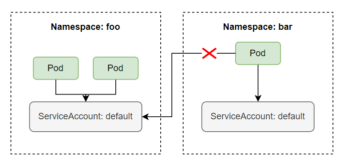
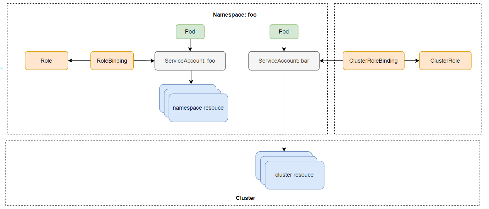
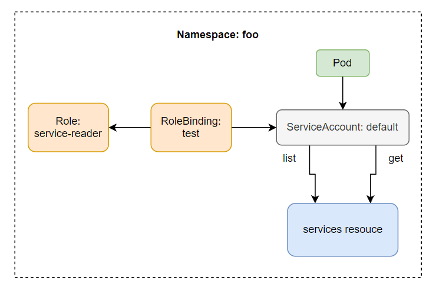
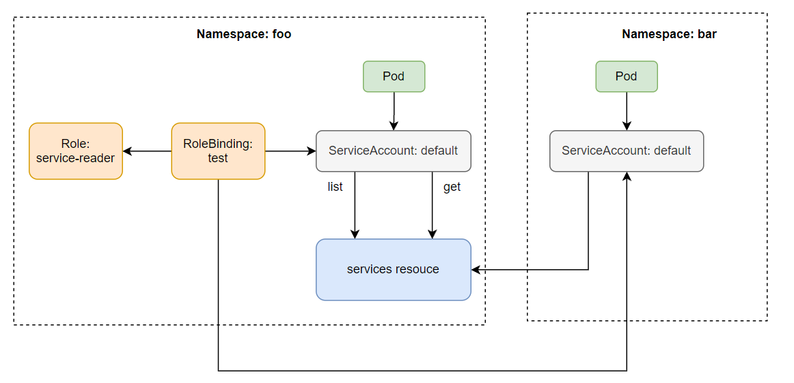

# ServiceAccount and Role Based Access Control: security kubernetes API server
## 1. Giới thiệu
Ở bài này chúng ta sẽ nói về ServiceAccount và Role Based Access Control (RBAC), cách để client có thể authentication tới API server dùng ServiceAccount, authorization dùng RBAC.

Ở bài [Downward-API](../09.Downward-API/README.md), chúng ta đã nói về cách một ứng dụng bên trong Pod có thể nói chuyện với API server bằng cách sử dụng ServiceAccount được mount vào bên trong Pod, bây giờ ta sẽ đi sâu hơn về resource ServiceAccount này.

## 2. Hiểu về cách kubernetes API server thực hiện authentication

Như chúng ta đã nói ở bài [Downward-API](../09.Downward-API/README.md), API server có thể được config với một hay nhiều authentication plugins, khi một request đi tới API server nó sẽ đi qua hết các authen plugins này. Những plugin này sẽ phân tách những thông tin cần thiết như username, user id, group mà client thực hiện request thuộc về.
### 2.1 Client

Có 2 loại client được API server phân biệt rõ ràng:

- Users
- Pod (ứng dụng chạy bên trong container)

Đối với user, thường sử dụng kubectl hoặc thực hiện một HTTP request với token để authentication tới API server. Còn đối với Pod, thì sẽ sử dụng ServiceAccount để authentication tới API server. Ở bài này chúng ta sẽ nói về cách Pod authentication tới API server.

### 2.2 Groups

Cả users và ServiceAccounts đề thuộc một hoặc nhiều group, group được dùng để grant permissions của tất cả user và ServiceAccounts nằm trong nó một lúc, thay vì phải grant permissions của từng thằng riêng lẽ.

Group này được phân tách ra bằng authentication plugin cùng với thông username và user id, có 4 group mặc định là:

- `system:unauthenticated` - được gán cho user không authenticated thành công.
- `system:authenticated` - được gán cho user authenticated thành công.
- `system:serviceaccounts` - group cho toàn bộ ServiceAccounts.
- `system:serviceaccounts`: `<namespace>` - group cho toàn bộ ServiceAccounts trong một namespace.

## 3. ServiceAccounts

Như chúng ta đã nói, ServiceAccount sẽ được tự động mount vào bên trong container của Pod ở folder `/var/run/secrets/kubernetes.io/serviceaccount`. Gồm 3 file là `ca.crt`, `namespace`, `token`.

File token này là file sẽ chứa thông tin của về Pod client, khi ta dùng nó để thực hiện request tới server, API server sẽ tách thông tin từ trong token này ra. Và ServiceAccount username của chúng ta sẽ có dạng dạng như sau `system:serviceaccount:<namespace>:<service account name>`, với `system:serviceaccount:<namespace>` là group và `<service account name>` là tên của ServiceAccount được sử dụng.

Sau khi lấy được thông tin trên thì server sẽ truyền ServiceAccount username này tới authorization plugins, để xem ServiceAccount này có được quyền thực hiện action hiện tại lên trên API server hay không.

Thì ServiceAccount thực chất chỉ là một resource để ứng dụng bên trong container sử dụng cho việc authenticated tới API server mà thôi. Ta có thể list ServiceAccount bằng câu lệnh:

```
$ kubectl get sa
>> NAME     SECRETS  AGE
>> default  1        10d
```

Và ServiceAccount này là một namespace resouce, nghĩa là chỉ có scope bên trong một namespace, ta không thể dùng ServiceAccount của namespace này cho một namespace khác được. Và mỗi namespace sẽ có một ServiceAccount tên là default được tự động tạo ra khi một namespace được tạo. Một ServiceAccount có thể được sử dụng bởi nhiều Pod bên trong cùng một namespace.



### 3.1 Sử dụng ServiceAccount để pull image từ private container registry

Trong serires này thì chúng ta chỉ mới xài public container image chứ chưa xài private container image. Khi làm dự án thực tế thì ta sẽ cần sử dụng **private container image** chứ không xài public container image, tại ta không bao giờ muốn container của sản phẩm chúng ta public trên mạng ai cũng tải về để chạy được. Thì để tải được image từ private registry về, ở trong config của Pod, ta phải khai báo thêm trường `imagePullSecrets`, như sau:
```
apiVersion: apps/v1
kind: Deployment
...
    spec:
      imagePullSecrets:
        - name: <secret-name> # secret use to pull image form private registry
      containers:
        - name: background-consume-queue
          image: registry.kala.ai/web-crm/background-consume-queue
...

```
Trường `imagePullSecrets` name sẽ chứa Secret name mà ta sử dụng để pull image từ private registry về. Secret name này được tạo bằng cách sử dụng câu lệnh sau:
```
$ kubectl create secret docker-registry <secret-name> --docker-server=<your-registry-server> --docker-username=<your-name> --docker-password=<your-pword>
```
- `<secret-name>` là tên của secret, docker-server là server registry, nếu bạn dùng `hub.docker.com` thì server registry là `docker.io`
- `docker-username` là username bạn dùng để login vào docker hub
- `docker-password` là password của username tương ứng tên docker hub. 

Ví dụ ta muốn pull image từ private registry là `registry.kala.ai`, thì ta tạo secret như sau:
```
$ kubectl create secret docker-registry my-secret --docker-server=registry.kala.ai --docker-username=username --docker-password=12345678
```

```
apiVersion: apps/v1
kind: Deployment
...
    spec:
      imagePullSecrets:
        - name: my-secret
      containers:
        - name: background-consume-queue
          image: registry.kala.ai/web-crm/background-consume-queue
...
```
Vậy nếu muốn pull image từ private registry thì mỗi khi viết config ngoài cách thêm trường `imagePullSecrets`, ta có thể dùng `ServiceAccount` để tối giản bước này. Khi một Pod được tạo, ServiceAccount tên là default sẽ tự động được gán cho mỗi Pod.
```
$ kubectl get pod <pod-name> -o yaml
apiVersion: v1
kind: Pod
metadata:
  creationTimestamp: "2021-10-14T07:42:11Z"
  ...
spec:
  ...
  schedulerName: default-scheduler
  securityContext: {}
  serviceAccount: default # here
  serviceAccountName: default # here
  ...
```
Ta sẽ thấy trường serviceAccount sẽ được tự động gán cho Pod với giá trị là `ServiceAccount: default`. Ta thử xem config của một ServiceAccount.
```
$ kubectl describe sa default
Name:                default
Namespace:           default
Labels:              <none>
Annotations:         <none>
Image pull secrets:  <none>
Mountable secrets:   default-token-tnbgw
Tokens:              default-token-tnbgw
Events:              <none>
```

Bạn để ý là config của một ServiceAccount được hiển thị ở trên có một trường tên là **Image pull secrets**, thì đây chính là trường có tác dụng tương tự như `imagePullSecrets` bên trong config của Pod, vậy những gì ta cần làm lúc này là cập nhật lại trường `imagePullSecrets` của default ServiceAccount, và ServiceAccount này sẽ tự động được gán vào trong Pod, và ta không cần khai báo trường `imagePullSecrets` trong mỗi config của Pod nữa, ta cập nhật trường `imagePullSecrets` của ServiceAccount như sau:
```
$ kubectl patch sa default --type json -p '[{"op":"replace","path":"/imagePullSecrets[0].name", "value": "my-secret"}]'
```

### 3.2 Tạo ServiceAccount

ServiceAccount là một resouce của kubernetes, vậy nên ta có thể tạo và xóa nó như các resouce khác một cách bình thường, kể cả nếu bạn xóa default ServiceAccount thì khi tạo Pod nó sẽ báo lỗi là không tìm thấy ServiceAccount để gán vào Pod thôi, thì khi ta xóa ServiceAccount default thì kubernetes sẽ tự động tạo lại một ServiceAccount mới cho ta, và Pod sẽ được tao ra lại bình thường.

Hoặc bạn cũng có thể tạo một ServiceAccount khác và chỉ định Pod sử dụng ServiceAccount mới này thay vì dùng default ServiceAccount. Để tạo ServiceAccount thì cũng rất đơn giản, ta chỉ cần gõ câu lệnh:
```
$ kubectl create sa bar
>> serviceaccount/bar created
$ kubectl describe sa bar
>> Name:                bar
>> Namespace:           default
>> Labels:              <none>
>> Annotations:         <none>
>> Image pull secrets:  <none>
>> Mountable secrets:   bar-token-ndvtr
>> Tokens:              bar-token-ndvtr
>> Events:              <none>
```
Ở trên khi ta describe một SA thì thấy nó có một trường tên là **Mountable secrets**, đây là tên của Secret được gán cho SA, khi một SA được tạo ra thì nó cũng sẽ tạo ra một Secret cho ta.
```
$ kubectl get secret
>> NAME                 TYPE                                 DATA
>> bar-token-ndvtr      kubernetes.io/service-account-token  3
>> default-token-4fsjr  kubernetes.io/service-account-token  3
$ kubectl describe secret bar-token-ndvtr
>> Name:         bar-token-ndvtr
>> Namespace:    default
>> ...
>> ca.crt:     1066 bytes
>> namespace:  7 bytes
>> token:      ...
>> ...
```

Khi ta describe secret được tạo ra bởi SA, ta sẽ thấy nó chứa 3 file, là 3 file mà sẽ được mount vào bên trong container của Pod ở folder `/var/run/secrets/kubernetes.io/serviceaccount`.

Để sử dụng ServiceAccount khác default bên trong Pod thì ta chỉ định ở trường `spec.serviceAccountName`.

```
apiVersion: apps/v1
kind: Deployment
...
    spec:
      serviceAccountName: bar
      containers:
        - name: background-consume-queue
          image: registry.kala.ai/web-crm/background-consume-queue
...
```

Vậy ta có cần tạo một SA khác không hay dùng một thằng thôi cho nhanh? Thì để trả lời vấn để này thì mặc định một thằng SA nếu ta không bật **Role Based Access Control authorization plugin** thì nó sẽ có quyền thực hiện mọi hành động lên API server, nghĩa là một thằng ứng dụng trong container có thể sử dụng SA để authentication tới API server và thực hiện list Pod, xóa Pod, tạo Pod mới một cách bình thường, vì nó có đủ quyền. Thì để ngăn chặn việc đó, ta cần enable Role Based Access Control authorization plugin.

## 4. Role Based Access Control
Thì kể từ version 1.8.0, RBAC sẽ được enable mặc định, và ta có thể tạo Role và gán với từng SA nhất định. Chỉ cho phép một SA thực hiện những hành động mà ta cho phép, theo **Principle of Least Privilege**.

### 4.1 Action

Các action ta có thể thực hiện tới API server là HEAD, GET, POST, PUT, PATCH, DELETE. Và những action này sẽ tương ứng với một verb mà ta sẽ dùng khi định nghĩa role.
|Action| 	Verb|
|------|--------|
|HEAD, GET| 	get|
|POST 	|create|
|PUT 	|update|
|PATCH 	|patch|
|DELETE 	|delete|

### 4.2 RBAC resources

RBAC sẽ có các resouce như sau:

- Roles: định nghĩa verb nào có thể được thực hiện lên trên namespace resouce
- ClusterRoles: định nghĩa verb nào có thể được thực hiện lên trên cluster resouce
- RoleBindings: gán Roles tới một SA
- ClusterRoleBindings: gán ClusterRoles tới SA

Điểm khác nhau của Roles và ClusterRoles là Roles là namespace resouce, nghĩa là nó sẽ thuộc về một namespace nào đó, và chỉ định nghĩa role cho SA trong một namespace. Còn ClusterRoles thì sẽ không thuộc namespace nào cả.


### 4.3 Tạo Role và RoleBinding

Bây giờ ta sẽ thực hành tạo Role và Clusterrole để hiểu rõ hơn về lý thuyết. Trước tiên ta sẽ tạo 2 namespace:
```
$ kubectl create ns foo
>> namespace/foo created
$ kubectl create ns bar
>> namespace/bar created
$ kubectl run test --image=luksa/kubectl-proxy -n foo
>> pod/test created
$ kubectl run test --image=luksa/kubectl-proxy -n bar
>> pod/test created
```

Truy cập vào Pod và thực hiện request.
```
$ kubectl exec -it test -n foo sh
/# curl localhost:8001/api/v1/namespaces/foo/services
>>
    {
    "kind": "Status",
    "apiVersion": "v1",
    "metadata": {},
    "status": "Failure",
    "message": "services is forbidden: User \"system:serviceaccount:foo:default\" cannot list resource \"services\" in API group \"\" in the namespace \"foo\"",
    "reason": "Forbidden",
    "details": {
        "kind": "services"
    },
    "code": 403
    }
```

Ta sẽ thấy là với RBAC được enable thì SA bây sẽ không có quyền gì cả. Để cho phép thằng default SA ở namespace foo có thể list được service trong namespace foo, thì ta cần phải tạo một Role và dùng RoleBinding để gán quyền cho default SA này. Tạo một file tên là `service-reader.yaml` với config như sau:
```
apiVersion: rbac.authorization.k8s.io/v1
kind: Role
metadata:
  namespace: foo
  name: service-reader
rules:
  - apiGroups: [""]
    verbs: ["get", "list"]
    resources: ["services"]

```
```
$ kubectl apply -f service-reader.yaml -n foo
```

Ở file config trên, thuộc tính apiGroups ta sẽ chỉ định nhóm của api ta muốn thực hiện hành động lên nó, ở trên ta chỉ định "" có nghĩa là core api group `/v1` path, nếu ta muốn thực hiện hành động lên deployment thì ta sẽ chỉ định apiGroups là apps/v1. Trường verb chỉ định action ta có thể thực hiện lên api group group trên, trường resources ta chỉ định là Service resources. Khi ta tạo Role xong, ta cần binding nó tới SA bằng cách dùng câu lệnh như sau:
```
$ kubectl create rolebinding test --role=service-reader --serviceaccount=foo:default -n foo
```
Hoặc viết file config như sau:
```
apiVersion: rbac.authorization.k8s.io/v1
kind: RoleBinding
metadata:
  name: test
  namespace: foo
roleRef:
  apiGroup: rbac.authorization.k8s.io
  kind: Role # this must be Role or ClusterRole
  name: service-reader # this must match the name of the Role or ClusterRole you wish to bind to
subjects:
  - kind: ServiceAccount # Kind is User or ServiceAccount
    name: default # name of the SA
    namespace: foo
```


Bây giờ thì khi ta có thể gọi API list service bên trong Pod được rồi.
```
/# curl localhost:8001/api/v1/namespaces/foo/services
{
  "kind": "ServiceList",
  "apiVersion": "v1",
  "metadata": {
    "selfLink": "/api/v1/namespaces/foo/services",
    "resourceVersion": "24906"
  },
  "items": []
}
```

Ta cũng có thể sử dụng Rolebinding ở namespace này cho SA ở một namespace khác. Bằng cách thêm SA vào trường subjects của Rolebinding.
```
$ kubectl edit rolebinding test -n foo
```

Khi ta thêm subject trên thì bây giờ SA ở namespace bar có thể đọc được services ở namespace foo.


### 4.4 Tạo ClusterRole và ClusterRoleBinding

Giờ thì ta sẽ qua phần tạo ClusterRole, ClusterRole cho phép một SA có thể truy cập được resouce của Cluster như Node, PersistentVolume, v...v... Ở trong Pod hiện tại, khi ta thực hiện API request để list persistentvolumes thì ta sẽ gặp lỗi.

Để thực hiện được action này, ta phải tạo ClusterRole, tạo file tên là `pv-reader.yaml` với config như sau:
```
apiVersion: rbac.authorization.k8s.io/v1
kind: ClusterRole
metadata:
  name: pv-reader
rules:
  - apiGroups: [""]
    verbs: ["get", "list"]
    resources: ["persistentvolumes"]
```

Config của ClusterRole cũng giống như Role, ta chỉ cần thay kind từ Role sang ClusterRole và không cần phải chỉ định namespace.
```
$ kubectl apply -f pv-reader.yaml
```
Sau đó ta tạo ClusterRoleBinding:
```
$ kubectl create clusterrolebinding pv-test --clusterrole=pv-reader --serviceaccount=foo:default
```
Bây giờ thì ta đã có thể gọi tới API server để list PV.
```
/# curl localhost:8001/api/v1/persistentvolumes
{
  "kind": "PersistentVolumeList",
  "apiVersion": "v1",
...
}
```

## 5. Kết luận

Vậy là ta đã tìm hiểu xong về cách để security cho API server dùng ServiceAccount với Role và ClusterRole. Khi làm thực tế, ta nên áp dụng Principle of Least Privilege, chỉ cho phép một thằng thực hiện được những thứ nó cần, không cung cấp những quyền không cần thiết cho nó. Bằng cách tạo những SA khác nhau và gán Role hoặc ClusterRole cho nó, xong assign SA đó cho Pod